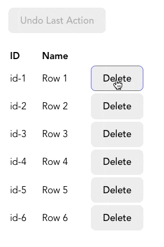

# Stack

## 1. 설명

- 기본적인 stack은 두 가지 특징을 가짐

  - stack의 상위에 아이템을 추가할 수 있음

  - stack의 상위에서부터 아이템을 제거할 수 있음

- **Last In First Out(LIFO)**

```javascript
const stack = [];

// "상위"에 item을 추가
stack.push("value");

// "상위"에서부터 item을 제거
const topItem = stack.pop();
```

<br>

## 2. 현실 세계에서의 예시: 이전 동작 취소
- 실무에서 사용자 인터렉션 기록을 추적하여 실행 취소 기능을 구현하고자 할 때 stack을 사용할 수 있음
- 아래와 같은 사용자가 각 행을 삭제할 수 있는 table을 만드는 것과 같음



- 사용자가 행을 삭제할 때마다 `history` 배열(위에서 만들었던 stack)에 추가
- 만약 사용자가 삭제를 취소하고 싶다면 `history`에서 가장 최근에 추가된 행의 정보를 가져와 table에 다시 추가

<br>

> `React`에서는 데이터가 불변해야 하므로 `Array.push()`와 `Array.pop()`은 사용할 수 없음
대신 새로운 배열을 반환하는 `Array.concat()`과 `Array.slice()`를 사용


```javascript
import { useReducer } from "react";

const rows = [
  {
    id: "id-1",
    name: "Row 1",
  },
  {
    id: "id-2",
    name: "Row 2",
  },
  ...
];

// "history"는 우리가 만든 stack
const initialState = { rows, history: [] };

function reducer(state, action) {
  switch (action.type) {
    case "remove":
      return {
        rows: removeRow(state, action),
        // Array.push() 대신 불변한 Array.concat()을 사용
        history: state.history.concat({
          action,
          row: state.rows[action.index]
        })
      };
    case "undo":
      return {
        rows: addRowAtOriginalIndex(state),
        // Array.pop() 대신 불변한 Array.slice()를 사용
        history: state.history.slice(0, -1)
      };
    default:
      throw new Error();
  }
}

function TableUsingStack() {
  const [state, dispatch] = useReducer(reducer, initialState);

  return (
    <>
      <button
        onClick={() => dispatch({ type: "undo" })}
        disabled={state.history.length === 0}
      >
        Undo Last Action
      </button>

      <table>
        <thead>
          <tr>
            <th>ID</th>
            <th>Name</th>
            <th></th>
          </tr>
        </thead>

        <tbody>
          {state.rows.map(({ id, name }, index) => (
            <tr key={id}>
              <td>{id}</td>
              <td>{name}</td>
              <td>
                <button onClick={() => dispatch({ type: "remove", id, index })}>
                  Delete
                </button>
              </td>
            </tr>
          ))}
        </tbody>
      </table>
    </>
  );
}
```

- `history`는 stack임
- 사용자가 **Remove** 버튼을 클릭하면 `history`에 action과 관련된 데이터를 추가
- **Undo Last Action** 버튼을 클릭하면 제일 최근의 action을 `history` stack에서 제거한 후 다시 행에 추가