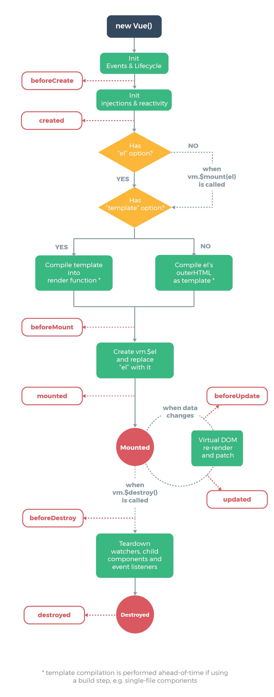

# Vue Lifecycle

## **Vue Lifecycle과 Lifecycle Hook**

- Vue 인스턴스나 컴포넌트가 생성되고 소멸되기까지의 단계
- 각 단계에서 실행되는 함수들을 Lifecycle Hook이라고 함
- Lifecycle의 flowchart

  
   

---

 

## **vue Lifecycle Hook**

### 1. Creation : 컴포넌트 초기화 단계

- Lifecycle에서 가장 먼저 실행
- 컴포넌트가 DOM에 추가되기 전에 수행하며 다른 후크와 달리 서버 렌더링 중에도 실행됨
- 클라이언트 렌더링 및 서버 렌더링 과정 모두에서 컴포넌트를 설정할 필요가 있다면 이 단계에서 처리함
- 컴포넌트가 DOM에 추가되기 전이기 때문에 DOM에 접근하거나 this.$el를 사용할 수 없음

 

**beforeCreate**

- 가장 먼저 실행되는 훅으로 컴포넌트 초기화
- 아직 데이터와 이벤트가 설정되지 않은 단계

**created**

- 템플릿 및 Virtual DOM이 마운팅 혹은 렌더링 되기 전에 실행
- 데이터와 이벤트가 활성화되어 액세스 할 수 있음
- 데이터 초기화 시에 사용
- 부모 > 자식 순으로 created 훅이 실행
   
   

### 2. Mounting : DOM 삽입 단계

- 가장 많이 사용되며, 초기 렌더링 전후에 즉시 컴포넌트에 액세스 가능
- 그러나 서버 측 렌더링이 실행되는 동안에는 실행되지 않음
- 초기 렌더링 직전이나 직후에 DOM에 접근하거나 수정해야 하는 경우 사용
- 초기화시 컴포넌트에 필요한 데이터를 가져와야 하는 경우 mounting 훅을 사용하지 않고 (특히 서버 측 렌더링 동안에 필요한 데이터가 있을 경우) created 훅을 사용하는 것이 나음
   
   

**beforeMount**

- 템플릿 및 render 함수가 컴파일된 후, 초기 렌더링이 일어나기 직전에 실행

**mounted**

- 컴포넌트, 템플릿, 렌더링된 DOM에 접근할 수 있고 DOM을 수정하기위해 사용
- 특히 뷰가 아닌 라이브러리를 통합할 때 사용
- 자식 > 부모 순으로 mounted hooks가 실행

 

### 3. Updating : Diff 및 Re-rendering 단계

- 컴포넌트에서 사용하는 반응형 속성들이 변경되거나 리렌더링될 때마다 호출
- 디버깅이나 프로파일링을 위해 컴포넌트가 다시 렌더링되는 시기를 알아야 하는 경우 사용
- 컴포넌트의 반응형 속성들이 언제 변경되는지 알아야 하는 경우에는 computed나 watch를 사용
   
   

**beforeUpdate**

- 컴포넌트 데이터가 변경되고 업데이트 주기가 시작된 후 DOM이 패치되고 다시 렌더링되기 직전에 실행
- 컴포넌트가 렌더링되기 전에 반응형 데이터의 신규 상태를 가져와야하는 경우 사용

**updated**

- 컴포넌트 데이터가 변경되어 DOM이 리렌더링 된 후 실행
- property가 변경된후 DOM에 접근해야할 때 사용
   
   

### 4. Destruction : 해체 단계

- 컴포넌트가 해체되고 DOM에서 제거될 때 실행
   
   

**beforeDestroy**

- 해체 직전에 실행되며 컴포넌트는 여전히 완전하게 존재하고 작동
- 이벤트 리스너나 reactive subscriptions를 정리하는데에 사용

**destroyed**

- 컴포넌트가 해체된 후 호출
- 컴포넌트가 파괴된 것을 원격 서버에 알려야 하는 경우 사용
   
   

### 5. 그 외 hooks

**activated**

- keep-alive 컴포넌트가 활성화될 때 호출

**deactivated**

- keep-alive 컴포넌트가 비활성화될 때 호출
