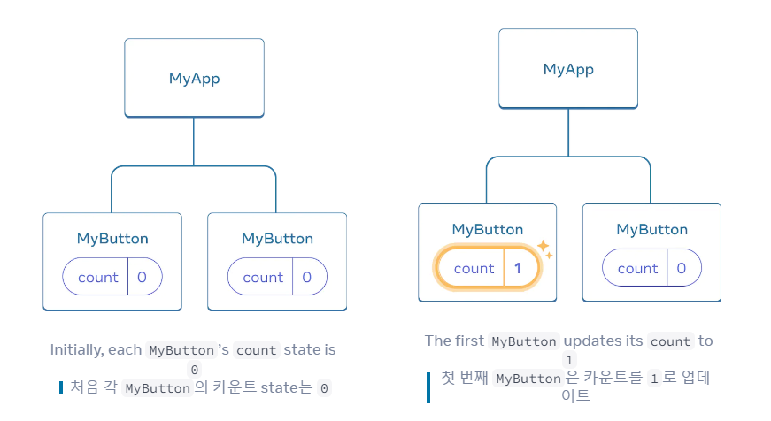
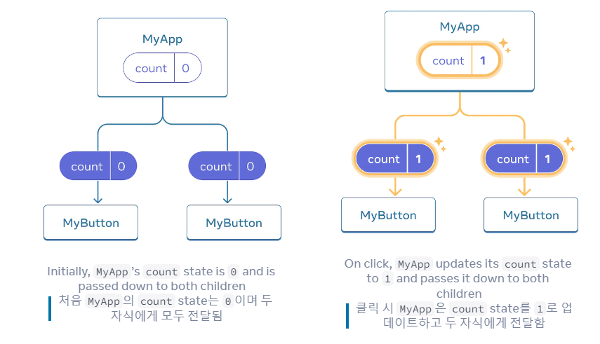

# React 공식문서 읽기 (4)

## 9. Using Hooks

`use`로 시작하는 함수를 *Hook*이라고 한다. `useState`는 React에서 제공하는 built-in Hook이다. 다른 built-in Hook은 [React API reference](https://react-ko.dev/reference/react)에서 찾을 수 있으며, 기존의 Hook을 조합하여 자신만의 훅을 작성할 수도 있다.

Hook은 일반 함수보다 더 제한적이다. 컴포넌트(또는 다른 Hook)의 *최상위 레벨*에서만 Hook을 호출할 수 있다. 조건문이나 반복문에서 `useState`를 사용하고 싶다면, 대신 새로운 컴포넌트를 추출하고 그 컴포넌트에 작성하라.

<br><br>

## 10. Sharing data between components

이전 예제에서는 각각의 `MyButton`에 독립적인 `count`가 있었고, 각 버튼을 클릭하면 클릭한 버튼의 `count`만 변경되었다.



하지만 데이터를 공유하고 항상 함께 업데이트하기 위한 컴포넌트가 필요한 경우가 많다.

두 `MyButton` 컴포넌트는 모두 동일한 `count`를 표시하고 함께 업데이트하려면 개별 버튼에서 모든 버튼이 포함된 가장 가까운 컴포너틑르로 `state`를 "위쪽"으로 이동해야 한다.

이 예제에서는 `MyApp`이다.



이제 두 버튼 중 하나를 클릭하면 `MyApp`의 `count`가 변경되어 `MyButton`의 두 개수가 모두 변경된다. 이를 코드로 표현하는 방법은 다음과 같다.

면저, `MyButton`에서 `MyApp`으로 state를 위로 이동한다.

```javascript
export default function MyApp() {
  const [count, setCount] = useState(0);

  function handleClick() {
    setCount(count + 1);
  }

  return (
    <div>
      <h1>Counters that update separately</h1>
      <MyButton />
      <MyButton />
    </div>
  );
}

function MyButton() {
  // ... we're moving code from here ...
}
```

그런 다음 `MyApp`에서 각 `MyButton`으로 share click handler와 함께 state를 전달한다. 이전에 ``와 같은 built-in tag에서 했던 것처럼 JSX중괄호를 사용하여 `MyButton`에 정보를 전달할 수 있다.

```javascript
export default function MyApp() {
  const [count, setCount] = useState(0);

  function handleClick() {
    setCount(count + 1);
  }

  return (
    <div>
      <h1>Counters that update together</h1>
      <MyButton count={count} onClick={handleClick} />
      <MyButton count={count} onClick={handleClick} />
    </div>
  );
}
```

이렇게 전달한 정보를 *props*라고 한다. 이제 `MyApp` 컴포넌트에는 count state와 handleClick 이벤트 핸들러가 포함되어 있으며, 이 두 가지를 각 버튼에 props로 전달한다.

마지막으로, 부모 컴포넌트에서 전달한 props를 _읽기_ 위해 `MyButton`을 변경한다.

```javascript
function MyButton({ count, onClick }) {
  return <button onClick={onClick}>Clicked {count} times</button>;
}
```

버튼을 클릭하면 `onClick` 핸들러가 실행된다. 각 버튼의 `onClick` prop은 `MyApp` 내부의 `handleClick` 함수로 설정되었으므로 그 안에 있는 코드가 실행된다. 이 코드는 `setClick(count + 1)`을 호출하여 `count` state 변수를 증가시킨다. 새로운 `count` 값은 각 버튼에 prop으로 전달되므로 모든 버튼에 새로운 값이 표시된다. 이를 "state 끌어올리기"라고 한다. state를 끌어올리면 컴포넌트 간에 공유할 수 있다.

```javascript
// App.js

import { useState } from "react";

export default function MyApp() {
  const [count, setCount] = useState(0);

  function handleClick() {
    setCount(count + 1);
  }

  return (
    <div>
      <h1>Counters that update together</h1>
      <MyButton count={count} onClick={handleClick} />
      <MyButton count={count} onClick={handleClick} />
    </div>
  );
}

function MyButton({ count, onClick }) {
  return <button onClick={onClick}>Clicked {count} times</button>;
}
```

