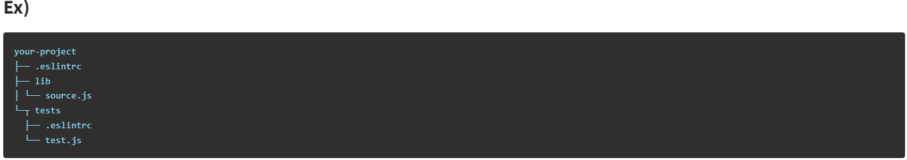
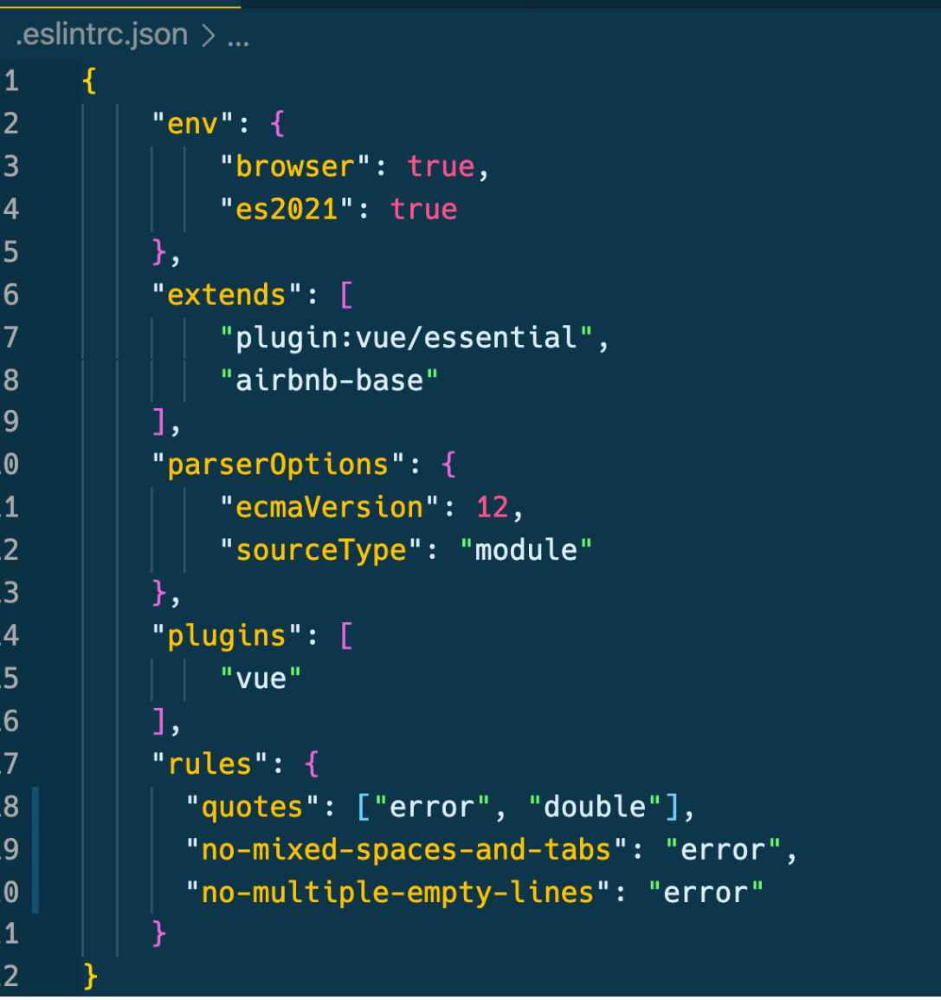

## ESLint란 무엇일까?

한마디로 ‘작성한 JS코드가 EcmaScript재단에서 명시한 Specifiaction에 부합하는지 검사해주는 툴’ 이라고 할 수 있다. ESLint는 문자 그대로 ES와 Lint를 합친 것이다.

ES는 EcmaScript로서 Ecma재단에서 만든 Script Specification이라 할 수 있고, Lint는 에러가 있는 코드에 표시를 달아주는 것을 의미한다. 나는 이미 Pylint를 사용해본 경험이 있어 ESLint를 보자마자 무엇인지 대충 감을 잡을 수 있었다.

ESLint는 코드에 특정 스타일과 규칙을 적용해서 문제를 사전에 찾고 패턴을 적용시킬 수 있는 정적 분석 툴로 분류 한다. 기본적인 기능은 에러도출이나 전반적인 코딩스타일(tab설정, ; 여부, usingSpaces 등)을 직접 정할 수도 있다. 자신의 스타일과 규칙을 정해서 사용할 수도 있고 대기업에서 사용하는 스타일과 규칙이 정해준 rule을 적용시킬 수도 있다.

.eslint 파일은 JavaScript, JSON 또는 YAML 파일을 이용해서 정의할 수 있다. 단 해당 파일은 적용하고자 하는 폴더들이 모인 루트 폴더에 넣어야 한다.



이렇게 파일 구조를 설정한 뒤 해당 디렉토리에서 eslint를 실행하면 lib 폴더 안에 있는 모든 파일들이 .eslintrc의 설정에 따라 변환된다. eslint가 tests 폴더에 도착했을 때 해당 폴더 안의 .eslintrc 파일이 추가적으로 적용되어 tests폴더 안의 파일들은 your-project/.selintrc 와 your-project/tests/.eslintrc 두 설정 파일들의 규칙이 전부 적용되게 된다. 만일 중복되는 Rule이 있는 경우 가장 가까운(해당 폴더 안에 들어있는) .eslint 설정을 따르게 된다고 한다.


https://eslint.org/docs/latest/

공식 사이트에 게재된 Rule들을 사용하기 위해서는 `"extends"` 에 `eslint:recommended` 속성이 추가되어 있어야 한다. 사이트에 보면 작은 렌치마크가 있는 속성들이 있는데 문제가 있으면 해당 속성은 코드를 자동으로 수정한다고 한다. Rule은 오브젝트 형태로 키는 속성의 이름이 되고 값은 "off", "warn", "error" 세가지가 될 수 있다.

"off" : 해당 Rule을 적용하지 않는다(끈다)
"warn" : 해당 Rule에 위배되면 경고를 띄운다(코드에는 영향을 미치지 않는다)
"error" : 해당 Rule에 위배되면 에러를 발생시킨다(에러가 발생하면 1을 exit code로 반환한다)



### 예를 들어서

```
`"no-mixed-spaces-and-tabs"` 와 `"no-multiple-empty-lines"`, `quotes:[error, double]` 세가지 이다.
각 속성은 “스페이스와 탭을 혼용하지 말 것”, “태그간 한 줄 이상, 또는 불필요한 공백을 두지 말 것”, “스트링은 무조건 " 을 사용할 것” 을 의미한다.
```

추가적으로 ESLint 검사에서 제외하고 싶은 파일들을 설정하기 위해서는 .eslintignore 파일을 만들면 된다고 한다! .gitignore 와 동일한 역할을 하는 듯 하다.
