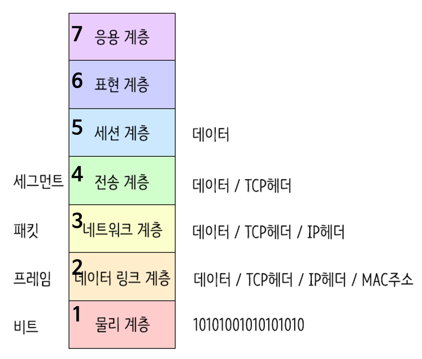
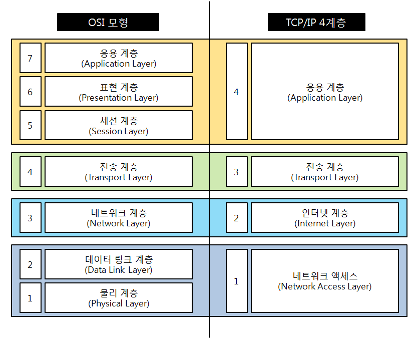

# OSI 7계층

## 1. OSI(Open System Interconnection) 7계층

- 국제표준화기구(ISO)에서 개발한 모델로, **네트워크 프로토콜 디자인과 데이터 통신을 계층**으로 나눠 표준화한 것

### **1계층 - 물리계층(Physical Layer)**

- 주로 전기적, 기계적, 기능적인 특성을 이용해서 통신 케이블로 데이터를 전송하는 **물리적인 장비**
- 단지 데이터 전기적인 신호(0,1)로 변환해서 주고받는 기능만 할 뿐
- 이 계층에서 사용되는 통신 단위 : **비트(Bit)**이며 이것은 **1과 0**으로 나타내어지는, 즉 전기적으로 On, Off 상태
- 장비 : **통신 케이블, 리피터, 허브** 등

### **2계층 - 데이터 링크계층(DataLink Layer)**

- 물리계층을 통해 송수신되는 정보의 오류와 흐름을 관리하여 안전한 **통신의 흐름을 관리**
- 프레임에 **물리적 주소(MAC address)**를 부여하고 에러검출, 재전송, 흐름제어를 수행
- 이 계층에서 전송되는 단위 : 프레임(Frame)
- 장비 : **브리지, 스위치, 이더넷** 등(여기서 MAC주소를 사용)
- > **브릿지나 스위치를 통해 맥주소를 가지고 물리계층에서 받은 정보를 전달함**.

### **3계층 - 네트워크 계층(Network Layer)**

- 데이터를 목적지까지 가장 안전하고 빠르게 전달
- 라우터(Router)를 통해 경로를 선택하고 주소를 정하고**(IP)** 경로(Route)에 따라 패킷을 전달 > IP 헤더 붙음
- 이 계층에서 전송되는 단위 : **패킷(Packet)**
- 장비 : **라우터**

### **4계층 - 전송 계층(Transport Layer)**

- **port 번호**, 전송방식**(TCP/UDP)** 결정 > **TCP 헤더** 붙음
  - TCP : 신뢰성, 연결지향적
  - UDP : 비신뢰성, 비연결성, 실시간
- 두 지점간의 **신뢰성** 있는 데이터를 주고 받게 해주는 역할
- 신호를 분산하고 다시 합치는 과정을 통해서 에러와 경로를 제어

### **5계층 - 세션 계층(Session Layer)**

- 주 지점간의 프로세스 및 통신하는 호스트 간의 연결 유지
- TCP/IP 세션 체결, 포트번호를 기반으로 **통신 세션** 구성
- API, Socket

### **6계층 - 표현 계층(Presentation Layer)**

- 전송하는 **데이터의 표현방식**을 결정(ex. 데이터변환, 압축, 암호화 등)
- 파일인코딩, 명령어를 포장, 압축, 암호화
- JPEF, MPEG, GIF, ASCII 등

### **7계층 - 응용 계층(Application Layer)**

- 최종 목적지로, 응용 프로세스와 직접 관계하여 일반적인 응용 서비스를 수행(ex. explore, chrome 등)
- HTTP, FTP, SMTP, POP3, IMAP, Telnet 등

## 2. TCP/IP 4계층과 OSI 7계층의 비교

### OSI 7계층

- 실제 인터넷에서 사용되는 TCP/IP OSI 참조 모델을 기반으로 상업적이고 실무적으로 이용될 수 있도록단순하된 현실화의 과정에서 채택된 모형
- 특정 계층에서 문제가 발생할 시 해당 계층만 개발하면 되므로 효율적인 개발이 가능하지만 지나치게 전문화됨
- 실질적으로 적용되는 예시가 적음

### TCP/IP 4계층

- 대부분의 데이터 통신이 TCP와 IP기반으로 이루어졌기 때문에 인터넷 프로토콜 그 자체를 표현함
- 사실상 인터넷 프로토콜을 대표하는 용어로서 사용
