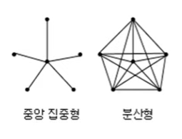
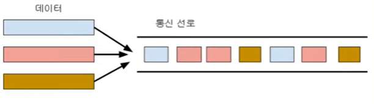
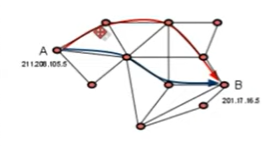
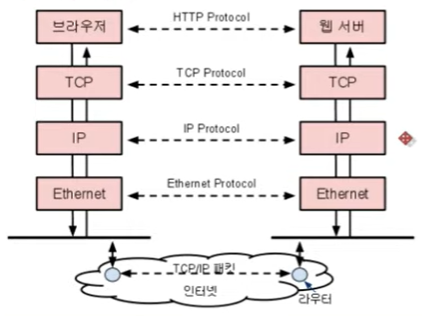
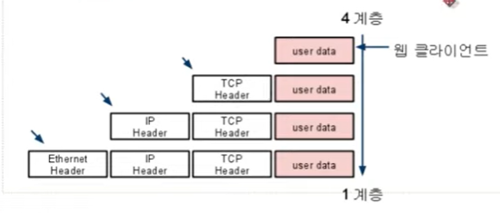
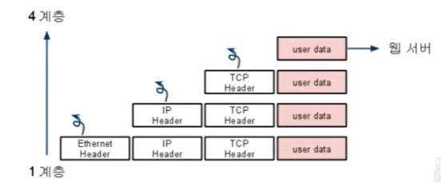
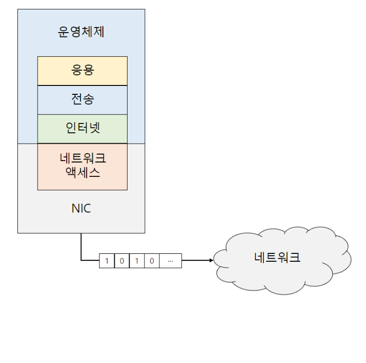

# TCP/IP 4계층

## 1. 네트워크와 TCP/IP

### 컴퓨터 네트워크

1. 네트워크 구조 (분산형)

   

- 중앙 집중형 : 하나의 노드가 파괴될 경우 전체 통신 체제 마비
- 분산형 : 여러 노드가 존재, 하나의 노드가 파괴되어도 전체 시스템에 문제 X

1.  패킷 통신 방식

- 상업적 컴퓨터 네트워킹을 위해 개발됨
- 데이터를 하나로 보내지 않고 여러개의 조각으로 나누어서 보내는 방식
- 패킷 재조직 부담이 있지만 네트워크 트래픽을 여러 컴퓨터에서 공유할 수 있어서 대량의 데이터 통신에 적합
- 한 번에 한 건만 보내는데, 하나의 노드만 점령해 다른 노드는 참여할 수 없음

**네트워크 구조**와 **패킷 통신 방식**이 결합되어 인터넷을 이루는 기반 기술이 만들어짐

### 네트워크 통신과 TCP/IP

- 인터넷은 범지구를 대상으로 하는 거대한 네트워크임
- 따라서 네트워크 구조를 유지하고 그 구조 안에서 원하는 데이터를 원활하게 주고받을 수 있는 규약이 필요해짐

1. **IP** : **네트워크 구조**를 유지하기 위한 프로토콜

   

   - 각 노드가 원하는 노드를 탐색할 수 있어야 함
   - 이를 위해서는 특정 노드가 전체 노드에서 구분되는 노드임을 보장받아야 함
   - 네트워크에 참여한 노드를 식별할 수 있게 만들어주는 프로토콜임
   - 각 노드에 4바이트 크기의 IP 주소를 발급, IP 주소를 이용해 원하느 노드로 경로를 설정함
   - A, B 사이에서 어느 노드로 보낼지 결정하는 일을 하는 컴퓨터를 라우터라고 함

2. **TCP** : **원활한** **통신을 보장**하기 위한 프로토콜
   - 패킷의 흐름을 제어하기 위한 프로토콜
   - 패킷 전송 과정에서 패킷의 순서가 변하거나 훼손될 수 있음
   - 패킷을 재조립하고, 훼손된 패킷을 재요청함

## 2. TCP/IP 4계층과 데이터 통신

- 네트워크 프로그램은 각 계층에서 제공하는 프로토콜을 이용해 상호 커뮤니케이션 하며 작동함

### Encapsulation(캡슐화)

- 4계층에서 1계층으로 진행
- 각 계층에서 필요한 프로토콜의 정보가 **헤더에 덧붙여짐**
- 이 과정을 Encapsulation이라고 함

### Demultiplexing(역 다중화)

- 1계층에서 4계층으로 진행
- 목적지에 도착한 데이터는 반대의 과정을 거쳐 웹 서버까지 도착함
- 이 과정을 Demultiplexing이라고 함

## 3. TCP/IP 4계층

### **1계층 - 네트워크 액세스 계층(Network Access Layer)**

- TCP/IP 패킷을 네트워크 매체로 전달하는 것과 네트워크 매체에서 TCP/IP 패킷을 받아들이는 과정을 담당
- 에러 검출 기능(Detecting errors), 패킷의 프레임화(Fraimg packets)
- 네트워크 접근 방법, 프레임 포맷, 매체에 대해 독립적으로 동작하도록 설계.
- 물리적인 주소로 **MAC**을 사용, 이 주소를 표시하는 장치는 **NIC**(Network Interface Controller)
- LAN, 패킷망, 등에 사용됨

### **2계층 - 인터넷 계층(Internet Layer)**

1. 어드레싱(addressing), 패키징(packaging), 라우팅(routing) 기능을 제공
2. 네트워크상 최종 목적지까지 정확하게 연결되도록 연결성을 제공하게 됨.
3. 프로토콜 종류 – IP, ARP, RARP

### **3계층 - 전송 계층(Transport Layer)**

: 운영체제가 데이터의 목적지를 확인 하고 애플리케이션에 전달하는 계층

1. 애플리케이션 계층의 세션과 데이터그램(datagram) 통신서비스 제공
2. 통신 노드 간의 연결을 제어하고, **신뢰성** 있는 데이터 전송을 담당한다.
3. 프로토콜 종류 – TCP, UDP

### **4계층 - 응용 계층(Application Layer)**

: 데이터가 생성되는 계층

1. 프로그램(브라우저)이 데이터를 처음으로 받는곳
2. 다른 계층의 서비스에 접근할 수 있게 하는 애플리케이션을 제공
3. 애플리케이션들이 데이터를 교환하기 위해 사용하는 프로토콜을 정의
4. HTTP, SMTP등의 프로토콜을 가진다.
5. TCP/UDP 기반의 응용 프로그램을 구현할 때 사용한다.
6. 프로토콜 종류 – FTP, HTTP, SSH

### 데이터 생성의 주체

- TCP/IP 4단계를 통해서 네트워크로 내보낼 수 있는 데이터를 생성함
- 각 단계는 수 많은 네트워크가 연결된 인터넷에서 가고자 하는 목적지를 올바르게 찾아갈 수 있도록 캡슐화 되어 있음
- 캡슐화된 데이터를 만드는 주체는 **운영체제**
- 운영체제는 사용자의 응용프로그램에서 생성한 데이터를 응용 → 전송 → 인터넷계층 순서로 단계적으로 캡슐화 한 후 NIC로 전달
- NIC에서는 마지막으로 네트워크로 내보내기 전 네트워크 액세스 계층으로 캡슐화 함
- 이렇게 캡슐화가 완료된 데이터의 이름을 **프레임**이라고 함
- 마지막으로 물리적인 유, 무선 매체를 통해 비트(bit)단위로 전송하게 됨
