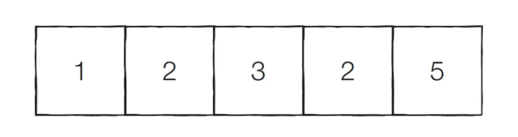
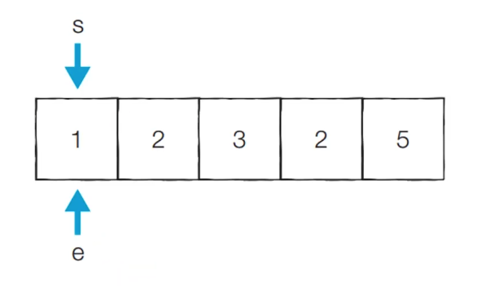
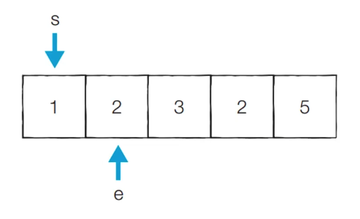
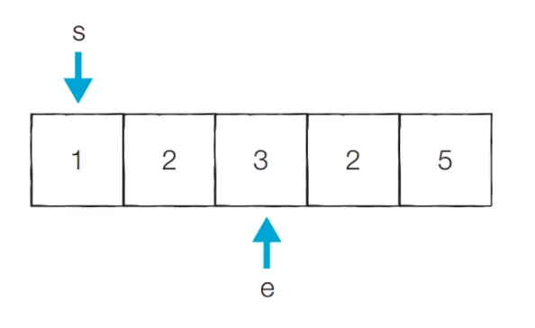
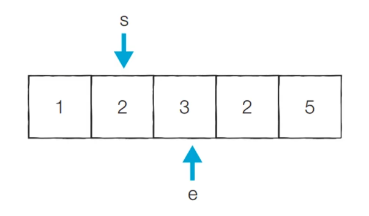
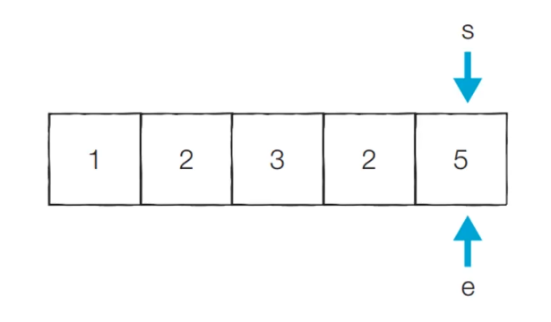

# 투포인터 (Two Pointers)

## 투포인터란?

- 리스트에 순차적으로 접근해야 할 때 두 개의 점의 위치를 기록하면서 처리하는 알고리즘
- 정렬되어있는 두 리스트의 합집합에도 사용됨
- 병합정렬(merge sort)의 counquer 영역의 기초가 되기도 함
  <br><br>

## 투포인터 예제

- **`특정한 합을 가지는 부분 연속 수열 찾기`**
- 투포인터 알고리즘의 대표적인 문제
- 어떤 숫자들의 리스트가 주어질 때, 해당 리스트의 연속 수열의 합이 특정 값을 가지는 것을 확인하는 문제

### 투포인터 알고리즘 원리

1. 시작점과 끝점이 첫번째 원소의 인덱스를 가리키도록 함
2. 현재 부분 합이 M과 같다면 카운트 함
3. 현재 부분 합이 M보다 작다면 end를 1 증가시킴
4. 현재 부분 합이 M보다 크거나 같다면 start를 1 증가시킴
5. 모든 경우를 확인할 때까지 2-4번 과정을 반복함

### 그림과 함께 설명하기



위와 같은 리스트와 M=5일 때의 예시를 생각해보기

1. 시작점과 끝점이 첫번째 원소의 인덱스를 가리키도록 설정
   
   - 현재 부분 합 : 1
   - 현재 카운트 : 0
2. 이전 단계에서의 부분합이 1 -> end를 증가시킴
   
   - 현재 부분 합 : 3
   - 현재 카운트 : 0
3. 부분합이 3 -> end를 증가시킴
   
   - 현재 부분 합 : 6
   - 현재 카운트 : 0
4. 부분합 6 -> start를 1 증가시킴
   
   - 현재 부분 합 : 5
   - 현재 카운트 : 1 (부분합이 5이기 때문에)
   - 1~3을 반복함
5. 
   - 현재 부분합 : 5

### 풀이 (파이썬 코드)

```python
n = 5 # 데이터의 개수 N
m = 5 # 찾고자하는 부분합 M

count = 0
interval_sum = 0
end = 0

# start를 차례대로 증가시키며 반복
for start in range(n):

    # end만큼 이동시키기
    while interval_sum < m and end < n:
        interval_sum += data[end]
        end += 1

    # 부분합이 m일 때 카운트 증가
    if interval_sum == m:
        count += 1
    interval_sum -= data[start]

print(count)
```

<br><br>

## 시간복잡도

- 매 루프마다 항상 두 포인터 중 하나는 1씩 증가하고 각 포인터가 n번 누적 증가해야 알고리즘이 끝남
- 각각 배열 끝에 다다르는데 O(N)이기 때문에 둘을 합해도 여전히 O(N)임
