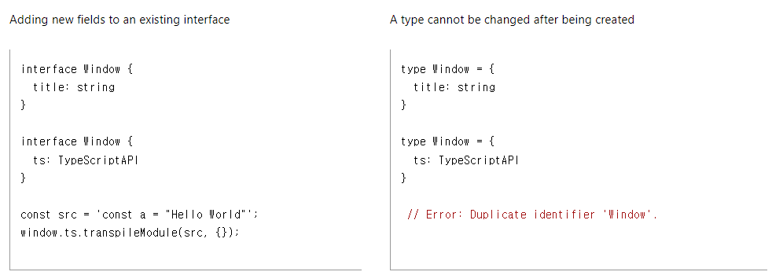

## TypeScript type alias와 interface

## type alias와 interface의 정의

### 공식 문서

```
A type alias is exactly that - a name for any type. An interface declaration is another way to name an object type
```

- 둘 다 타입에 이름을 부여해주는 것
- type alias는 모든(any) 타입에 이름을 달아줄 수 있음
- interface는 오직 객체 타입에만 가능함
- 그렇다면 interface는 왜 존재하는가?
  - object에 대한 타입을 선언하는 데 type alias와 interface 중에 무엇을 사용해아할까?

## type alias와 interface의 차이

### 공식 문서

```
Differences Between Type Aliases and Interfaces

Type aliases and interfaces are very similar, and in many cases you can choose between them freely. Almost all features of an interface are available in type, the key distinction is that a type cannot be re-opened to add new properties vs an interface which is always extendable.
```

- type alias는 새로운 프로퍼티에 열려있지 않고, interface는 항상 열려있음

### 예시



1. interface로 타입을 선언 (왼쪽)

- 선언된 타입의 이름과 같은 이름으로 새로운 타입을 선언했지만, 에러가 나지 않고 나중에 선언된 타입의 프로퍼티를 가지고 있음
- 결론 : **interface는 확장 가능함** (이를, 선언 병합이라고 함)

2. type alias로 타입을 선언 (오른쪽)

- interface에서는 같은 이름으로 선언해도 에러가 나지 않앗지만, 여기서는 식별자 ‘Window’가 중복된다라는 에러를 띄움
- **type은 확장할 수 없음**

## type alias와 interface를 나눠놓은 이유

1. type alias가 존재하는 이유

- 타입의 속성이 추가되지 않는다는 명백한 표현
- let과 const의 차이와 유사

2. interface가 존재하는 이유

- 기존에 선언된 타입을 확장해서 다른 속성을 추가로 선언할 수 있음
- 라이브러리를 사용하는 상황에서 추가적으로 타입의 속성들을 선언할 때 유용함
- 예시 : emoition (CSS in JS 라이브러리)

```js
// @emotion/react/types
export interface Theme {}

// emotion.d.ts
import '@emotion/react';

declare module '@emotion/react' {
  export interface Theme {
    colors: typeof Colors;
  }
}
```

- emotion의 types를 보면 interface 키워드를 통해 Theme이라는 타입을 제공해줌
- emotion 라이브러리를 사용하는 개발자는 해당 타입에 선언 병합을 활용해 본인들이 원하는 속성들을 선언해 사용해줄 수 있음

## 결론

- type-alias는 모든 타입을 선언할 때 사용될 수 있고, interface는 객체에 대한 타입을 선언할 때 사용될 수 있음
- 둘 다 객체에 대한 타입을 선언하는 데 사용될 수 있는데, 확장 측면에서 사용 용도가 달라짐
- 확장이 불가능한 타입을 선언하려면 type-alias를 사용하면 되고, 확장이 가능한 타입을 선언하려면 선언 병합이 가능한 interface를 사용하면 됨
