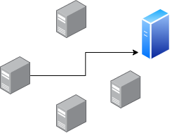
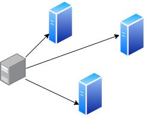
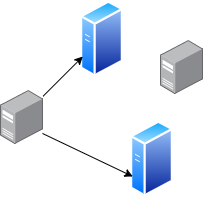
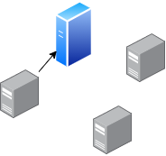

## 맥주소(MAC address)

- **네트워크 상에서 서로를 구분하기 위하여 기기마다 할당된 물리적 주소**
- 인터넷이 가능한 장비(PC, 휴대폰 등)들이 가지고 있는 물리적인 주소
- MAC주소는 12자리 숫자로 구성되어 있으며 숫자중 앞의 6자리(24bit)는 벤더(제품제조사)에 할당되며 나머지 6자리(24bit)는 각 벤더에서 제품에 할당
- 통신을 위해서는 MAC주소를 알아야 함
- IP주소로 MAC주소를 알기 위해서는 IP주소를 MAC으로 바꾸는 ARP(Address Resolution Protocol)과정이 필요함

---

## 유니캐스트(unicast)

### 개념

- **송신 노드 하나가 수신 노드 하나에 데이터를 전송하는 통신 방식 (1:1)**
- 특정 목적지의 주소 하나만을 가지고 통신하는 방식

### 특징

- **현재 네트워크상에서 가장 많이 사용되는 통신 방식**
- 수신 노드에서 자신의 MAC과 비교하여 동일할 경우에만 CPU에 해당 프레임을 올리고, 동일하지 않으면 해당 통신을 받지 않기 때문에 CPU 성능을 저하시키지 않음

---

## 브로드캐스트(broadcast)

### 개념

- **같은 네트워크에 있는 모든 장비들에게 보내는 통신 방식 (1:All)**
- 송신 노드 하나가 네트워크에 연결된 수신 가능한 모든 노드에 데이터를 전송

### 특징

- 받기 싫다고 해서 받지 않는 것이 아니라 무조건 받을 수 밖에 없음
- 브로드캐스트의 주소는 FFFF.FFFF.FFFF(MAC 주소로 했을 때)로 정해져있음
- 이 주소가 오면 랜카드는 자신의 MAC 주소와 같지 않아도 이 브로드캐스트 패킷을 CPU에 보냄

### 장단점 및 사용 예시

- 자신의 MAC 주소와 다르면 통신을 받지 않는 유니캐스트 방식에 비해서 CPU가 할 일이 늘어나 **CPU의 성능이 저하됨**
- 네트워크상의 전체 노드로 전송되기 때문에 **전체적인 트래픽이 증가함**
- **ARP가 대표적인 브로드캐스트**
  - 처음 두 PC 간에 통신을 하는 경우에는 상대편의 MAC 주소를 모르기 때문에 상대의 MAC 주소를 알아내기 위해 ARP를 함

---

## 멀티캐스트(multicast)

### 개념

- **특정 그룹을 지정해서 해당 그룹원에게만 보내는 통신 방식 (1:N)**
- 송신 노드 하나가 네트워크에 연결된 하나 이상의 수신노드에 데이터를 전송
- 여러명에게 보내야 할 경우에 사용하는 방식으로 **유니캐스트와 브로드캐스트를 합쳐놓은 듯한 개념**

### 유니캐스트, 브로드캐스트와의 비교 (1:N 통신에서)

- 유니캐스트 : MAC을 모두 확인해서 같은걸 여러번 반복해서 보내야 하므로 수량이 많을수록 네트워크 부하가 커짐
- 브로드캐스트 : 해당 네트워크 전체에 보내므로 관련없는 PC에서는 CPU사용률이 증가하게 되는 문제점이 있음
- **멀티캐스트는 한 번에 보내고자 하는 그룹 멤버들에게만 보낼 수 있으므로** 유니캐스트, 브로드캐스트의 단점을 보완할 수 있음

### 장단점

- 장점
  - 여러번 반복하지 않고 한 번에 보낼 수 있음
  - 원하는 그룹 멤버들에게만 보낼 수 있음
- 단점
  - **라우터나 스위치에서 이 기능을 지원해 주어야만 사용할 수 있음**
  - 만약 라우터나 스위치가 멀티캐스트를 지원하지 않는다면 라우터는 모두 막아버리고 스위치의 경우는 모든 포트로 뿌려버림

---

## 애니캐스트(anycast)

### 개념

- **가장 가까운 Node와 통신하는 방식**
- 네트워크에 **연결된 수신 가능한 노드 중에서 가장 거리가 가까운 한 노드**에만 데이터를 전송함

### 특징 및 사용 예시

- 동일한 애니캐스트 IP가 서로 다른 노드들에 할당되어 있을 때, 해당 애니캐스트 IP로 IPv6 Packet을 전송하면 라우팅 프로토콜 알고리즘에 따라 **가장 가까이에 있다고 판단되는 노드로 전달됨**
- **애니캐스트 IP는 서로 다른 곳, 서로 다른 호스트 끼리 동일한 IP주소를 가질 수 있는 개념**
- 라우팅 프로토콜에 의해 충돌난 IP에 대해서 가장 최적의 경로의 IP를 가진 서버를 1개 선택해서 라우팅 해줌
- \***\*애니캐스트를 사용한 DNS\*\***
  - 도메인 이름 시스템(Domain Name System)의 약자로, 도메인 이름을 컴퓨터가 읽을 수 있는 영문자와 숫자로 된 IP 주소로 변환하는 시스템
  - DNS 확인자는 이를 관리하는 서버를 말하는데, 사용자가 웹사이트를 로드하려 할 때 클라이언트 기기는 해당 웹사이트의 IP 주소를 DNS 확인자에게 질의해야 함
  - 애니캐스트 DNS에서는, DNS 질의가 하나의 특정 확인자가 아닌 DNS 확인자 중 가장 가까운 곳으로 데이터를 전송하게 됨

### 사용 목적

- 트래픽 분산
- DDoS 방어 제공
  - 특정 IP 주소로의 요청에 대해 다수의 서버가 응답하므로, 한 대의 서버를 압도할 수 있는 수천 개의 요청이 다수의 서버에 나눠짐
- 송신 노드와 수신 노드간의 물리적인 거리를 줄임으로써 응답 시간의 최소화

---

## IP와 통신방식

- IPv4 = 유니캐스트, 멀티캐스트, 브로드캐스트
- IPv6 = 유니캐스트, 멀티캐스트, 애니캐스트
