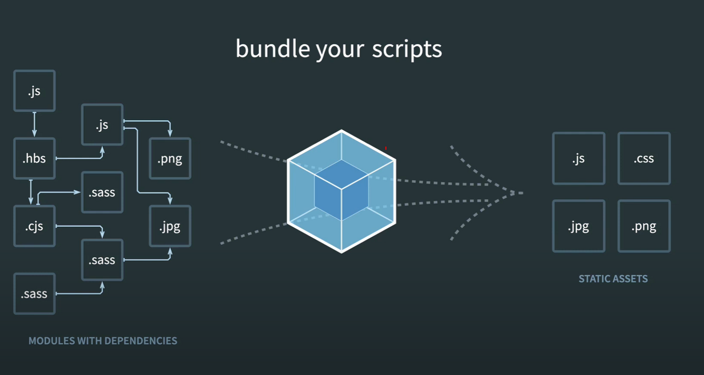

# Webpack

웹사이트를 구성할 때 `.js` `.css` `.images` 파일 등 수 많은 파일들이 모여 웹사이트를 구성하게 된다.

따라서 웹사이트에 접속했을 때 굉장히 많은 파일이 다운로드될 수 있는데 이것에 비례하여 서버의 자원을 소모하고 웹사이트가 느리게 로딩이 된다.

또한, 많은 자바스크립트 패키지 등을 사용하다보면 각각의 서로 다른 패키지들이 서로 다른 이름이나 함수를 사용하게 되면서 애플리케이션이 깨지게 되는데,
이러한 현상을 해결하기 위해 나온 개념이 **묶는다**는 개념의 **번들러**가 등장하였다.

**Webpack, Browserify, Parcel**과 같은 도구들이 번들러에 속한다.

그 중에서도 가장 인기 있는 번들러가 웹팩이다.

 

## 1. Webpack의 정의

- **모던 JavaScript 애플리케이션을 위한 정적 모듈 번들러**

  - 모듈 번들러 : 웹 애플리케이션을 구성하는 자원(HTML, CSS, JavaScript, Images 등)을 모두 각각의 모듈로 보고 이를 조합해서 병합된 하나의 결과물을 만드는 도구

- 간단하게 표현하자면, 웹펙이란 **여러 파일을 하나 이상의 파일로 합쳐주는 자바스크립트 번들러**

 

## 2. Webpack의 등장 배경

1. 파일 단위의 자바스크립트 모듈 관리의 필요성
2. 웹 개발 작업 자동화 도구 (Web Task Manager)
3. 웹 애플리케이션의 빠른 로딩 속도와 높은 성능

수 많은 파일이 모여 하나의 웹 사이트를 구성하게 된다. 인터넷의 발전으로 웹 어플리케이션의 복잡도가 증가하면서 자바스크립트의 코드의 양이 방대해지고 이러한 코드를 쉽게 유지보수하기 위해 모듈로서 관리하는 방법이 필요하게 된었다.

자바스크립트에서 ES2015(ES6) 이전에는 모듈로서 관리하는 방법으로 AMD, CommonJs 등이 존재했으나 하나의 표준이 아닌 사용하는 사람에 따라 원하는 것을 선택하는 방식으로 사용해왔다.

그 후, ES6 이후부터 자바스크립트에서 표준 모듈 시스템을 제안하였고 이것이 **export/import 방식**이다.

그러나 모든 모든 브라우저에서 ES6 방식의 모듈 시스템을 지원하지는 않았다. 따라서 개발자들은 **브라우저와 버전에 상관없이 편리한 모듈 시스템을 사용하기를 원했고** 이러한 배경에 의해 등장하게된 툴이 웹팩이다.

 

## 3. Webpack에서의 모듈

웹팩에서 지칭하는 모듈은 자바스크립트 모듈 뿐만이 아닌 HTML, CSS, JS, Images, Font 등 모든 파일 하나하나 모듈이라 지칭하며 **웹 애플리케이션을 구성하는 모든 자원**을 모듈이라 보면 된다.

보통 모듈 번들링에서는 **빌드**, **번들링**, **변환** 이 세 단어는 모두 같은 의미로 사용된다고 한다.
