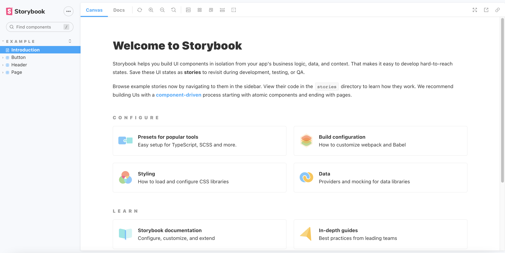
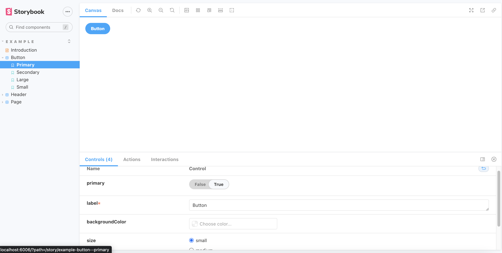
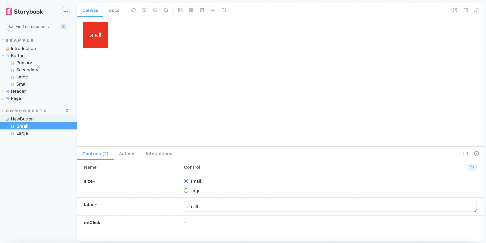

# React를 위한 Storybook 튜토리얼

## 1. 환경설정

React 설치

```bash
npx create-react-app@latest first-storybook --template=typescript
```

스토리북 설치

```bash
npx -p @storybook/cli sb init 
```

```js
"devDependencies": {
    "@storybook/addon-actions": "^6.5.13",
    "@storybook/addon-essentials": "^6.5.13",
    "@storybook/addon-interactions": "^6.5.13",
    "@storybook/addon-links": "^6.5.13",
    "@storybook/builder-webpack5": "^6.5.13",
    "@storybook/manager-webpack5": "^6.5.13",
    "@storybook/node-logger": "^6.5.13",
    "@storybook/preset-create-react-app": "^4.1.2",
    "@storybook/react": "^6.5.13",
    "@storybook/testing-library": "^0.0.13",
    "@types/styled-components": "^5.1.26",
    "babel-plugin-named-exports-order": "^0.0.2",
    "prop-types": "^15.8.1",
    "webpack": "^5.74.0"
  }
```

```javascript
"scripts": {
  "start": "react-scripts start",
  "build": "react-scripts build",
  "test": "react-scripts test",
  "eject": "react-scripts eject",
  "storybook": "start-storybook -p 6006 -s public",
  "build-storybook": "build-storybook -s public"
},
```

### 1.1. 폴더 설명

- stories : example(예시) 컴포넌트들이 들어가있다.
- .storybook : main.js와 preview.js가 생성된다.

```javascript
// main.js

module.exports = {
    stories: [
        "../src/**/*.stories.mdx",
        "../src/**/*.stories.@(js|jsx|ts|tsx)",
    ],
    addons: [
        "@storybook/addon-links",
        "@storybook/addon-essentials",
        "@storybook/addon-interactions",
        "@storybook/preset-create-react-app",
    ],
    framework: "@storybook/react",
    core: {
        builder: "@storybook/builder-webpack5",
    },
};
```

- stories를 위한 다양한 설정 파일이 들어가있다.
- addons를 통해 여러가지 확장 프로그램을 추가하고 다양한 기능들을 쓸 수 있다.

```javascript
// preview.js

export const parameters = {
  actions: { argTypesRegex: "^on[A-Z].*" },
  controls: {
    matchers: {
      color: /(background|color)$/i,
      date: /Date$/,
    },
  },
}
```

- story에 global하게 적용되는 포맷을 설정하는 곳이다.

<br>

## 2. 실행하기

```bash
npm run storybook
```





<br>

## 3. 컴포넌트 제작

```tsx
// components/newButton.tsx

import styled from "styled-components";

interface NewButtonProps {
    label: string;
    size: "small" | "large";
    onClick?: () => void;
}

function NewButton({ label, size, onClick }: NewButtonProps) {
    return (
        <NewButtonStyle size={size}>
            <p>{label}</p>
        </NewButtonStyle>
    );
}

const NewButtonStyle = styled.div<{ size: "small" | "large" }>`
    background-color: red;
    color: whitesmoke;
    width: ${(props) => (props.size === "small" ? "75px" : "200px")};
    height: ${(props) => (props.size === "small" ? "75px" : "200px")};
    display: flex;
    align-items: center;
    justify-content: center;
`;

export default NewButton;
```

간단하게 props로 label, size를 전달해줄수 있는 버튼을 만들었다.

<br>

## 4. Story 연결

컴포넌트에 Story를 연결하기 위해서는 `.stories.tsx`라는 확장자의 파일을 만들어야한다.

```tsx
// components/newButton.stories.tsx

import { ComponentMeta, ComponentStory } from "@storybook/react";
import NewButton from "./newButton";

export default {
    title: "Components/NewButton", // story 이름
    component: NewButton,
} as ComponentMeta<typeof NewButton>;

const Template: ComponentStory<typeof NewButton> = (args) => (
    <NewButton {...args} />
);

export const Small = Template.bind({});
Small.args = {
    size: "small",
    label: "small",
}; // Small의 props 지정

export const Large = Template.bind({});
Large.args = {
    size: "large",
    label: "large",
}; // Large의 props 지정
```

위와 같이 코드를 짜고 저장하면 자동으로 반영이된다.



위와 같이 만든 컴포넌트를 props에 어떤값이 들어가냐에 따라 어떻게 렌더링이 되는지 확인 할 수 있다.

<br>

## 5. 부가 기능

- decorator
  - 스토리북에 보여질 때 스타일을 지정할 수 있다.
- parmeters
  - 스토리북에서는 배경색, 화면사이즈와 같은 요인들을 변경해가면서 컴포넌트를 확인 할 수 있는데 그에 대한 option을 설정할 수 있다.

<br>

## 6. 배포하기

### 6.1. 정적으로 배포하기

``` bash
npm run build-storybook
```

앞선 환결설정에서 추가되었던 명령어를 이용해 빌드파일을 반들고 별도의 호스팅을 하면된다.

<br>

### 6.2. Chromatic 사용하기

> chromatic : storybook 관리자가 만든 무료 배포 사이트

- 먼저 깃헙에 해당 프로젝트를 올리고, chromatic 사이트에서 회원가입 후 해당 프로젝트를 연동해준다.

- 다음 코드를 해당 프로젝트에 입력

```bash
yarn add -D chromatic
yarn chromatic --project-token=<project-token>
```

이 과정을 거치면 배포된 url을 받을 수 있다.


