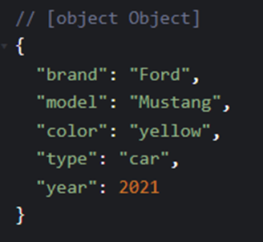

# [React] Spread Operator

React 배열을 다룰 때 spread 연산자를 사용해서 배열의 값들을 초기화하거나 확장시킬 수 있다.

이제까지 사용한 배열과 관련된 함수를 적용하면 아래와 같이 사용할 수 있다.

```javascript
const singerOne = ['청하', '여자아이들', '우주소녀']
const singerTwo = ['홍대광', '악동뮤지션', '볼빨간사춘기']
const combinedOne = singerOne.concat(singerTwo);
```

<br>

여기서 중간에 어떤 가수 이름을 추가하거나, concat이라는 함수를 사용하지 않고 spread 문법을 사용하면 아래와 같이 정리할 수 있다. 

```javascript
 const combinedTwo = [...singerOne, 'BTS', ...singerTwo];
// 청하,여자아이들,우주소녀,BTS,홍대광,악동뮤지션,볼빨간사춘기가 출력된다.
```

<br>

위와 같이 배열을 확장할 수도 있고

```javascript
const numbers = [1, 2, 3, 4, 5, 6];
const [one, two, ...rest] = numbers;
// …rest를 출력하면 3,4,5,6이 출력된다.
```

위와 같이 초기화할 수도 있다.

<br>

추가적으로 객체도 결합해서 사용할 수 있는데

```javascript
const myVehicle = {
  brand: 'Ford',
  model: 'Mustang',
  color: 'red'
}
 
const updateMyVehicle = {
  type: 'car',
  year: 2021,
  color: 'yellow'
}
 
const myUpdatedVehicle = {...myVehicle, ...updateMyVehicle}
console.log(myUpdatedVehicle)
```



출력하면 위와 같은 결과가 나온다.
