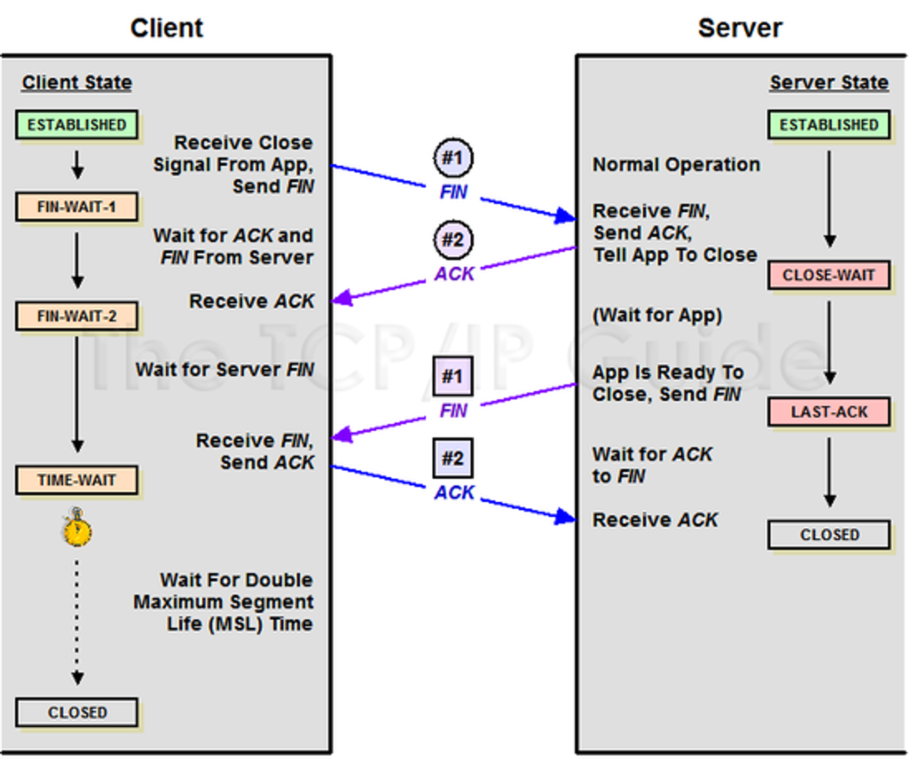

# 4-way Handshaking에서 TIME_WAIT 상태가 필요한 이유

## TCP 4-way Handshaking



**전체 과정 중에서 3, 4번 과정에 주목**

```
3. B의 연결 종료
- 연결을 종료할 준비가 되면, 연결 해지를 위한 준비가 되었음을 알리기 위해 **A 클라이언트에게 FIN 플래그를 전송**
- 이때 B 서버는 LAST-ACK 상태

4. A의 B 종료 요청 확인
- A 클라이언트는 해지준비가 되었다는 ACK를 확인했다는 메시지를 보냄
- A 클라이언트의 상태가 TIME-WAIT 으로 변경되고, 일정 시간 이후 CLOSE 상태로 변화함
```

## TIME_WAIT의 필요성

- 만약 B 서버에서 FIN을 전송하기 전에 (세션 종료 전에) 전송한 패킷이 라우팅 지연이나 패킷 유실로 인한 재전송 등으로 인해 FIN 패킷보다 늦게 도착하는 상황이 발생한다면?
- A 클라이언트에서 세션을 종료시킨 후 뒤늦게 도착하는 패킷이 있다면 이 패킷은 유실됨
- A 클라이언트는 이러한 현상에 대비하여 B 서버로부터 FIN을 수신하더라도 일정시간(디폴트 240초) 동안 세션을 남겨놓고 잉여 패킷을 기다리는 과정을 거치게 설정되어있음
- 세션을 남겨놓고 패킷을 기다리는 이 상태를 **TIME_WAIT** 라고 함
- 일정시간이 지나면, 세션을 만료하고 연결을 종료시키며 **CLOSE** 상태로 변화함

## 정리

- 세션 종료 시 4-way Handshaking을 사용함
- 4-way Handshaking에서 FIN을 수신한 직수 세션을 종료한다면 뒤늦게 도착한 패킷이 유실될 수 있음
- 이러한 현상에 대비해 서버로부터 FIN을 수신하고 나서 일정 시간동안 잉여 패킷을 기다리는 TIME_WAIT 상태가 필요함