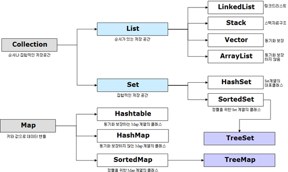

# [Java] 컬렉션(Collection)

## 1. Collection이란?

객체의 모음, 그룹이라고 할 수 있다.

자바에서 모든 컬렉션 클래스와 인터페이스를 포함하는 **Collection Framework**라는 개념이 JDK 1.2에서 정의가 되었다.

Collection 인터페이스(`java.util.Collection`)와 Map 인터페이스(`java.util.Map`) 자바 컬렉션 클래스의 주요 **루트**인터페이스이다.

Collection 인터페이스는 List, Set과 이미지에는 없지만 Queue 3가지의 상위 인터페이스로 분류할 수 있다.

Map은 Collection에 포함되지 않지만 Collection으로 분류를 해준다.

 

Collection을 사용하는 이유에는 3가지가 있다.

1. **일관된 Api**
  - Collection의 일관된 API를 사용하여 Collection 밑에 있는 모든 클래스(ArrayList, Vector, LinkedList 등) Collection에서 상속받아 통일된 메서드를 사용하게 된다.

2. **프로그래밍 노력 감소**
  - 객체 지향 프로그래밍의 추상화의 기본 개념이 성공적으로 구현되어있다.

3. **프로그램 속도 및 품질 향상**
  - 유용한 데이터 구조 및 알고리즘은 성능을 향상시킬 수 있다. Collection을 사용하여 최상의 구현을 생각할 필요없이 간단하게 Collection API를 사용하여 구현을 하면 된다.

