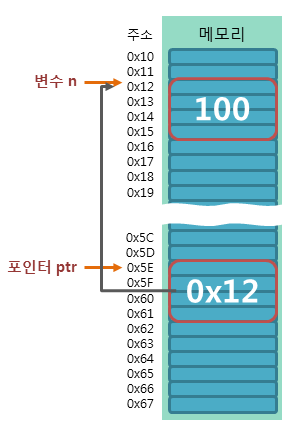

# [C언어] 포인터(Pointer)

## 1. 주소값의 이해

- **데이터의 주소값** : 해당 데이터가 저장된 메모리의 시작 주소
- C언어에서는 이러한 주소값을 1바이트 크기의 메모리 공간으로 나누어 표현
  - ex) int형 데이터는 4바이트의 크기를 가지지만, int형 데이터의 주소값은 시작 주소 1바이트만을 가리킴


<br>

## 2. 포인터란?

- 메모리의 주소값을 저장하는 변수
- 포인터 변수라고도 부름
- char형 변수가 문자를 저장하고, int형 변수가 정수를 저장하는 것처럼 포인터는 주소값을 저장함

```c
int n = 100;    // 변수의 선언
int* ptr = &n;  // 포인터의 선언
```

- 위의 예제에서 사용된 변수와 포인터가 메모리에서 어떻게 저장되는지 보여주는 예제


<br>

## 3. 포인터의 연산자

### 3.1. 주소 연산자(&)

- 변수의 이름 앞에 사용하며, 해당 변수의 주소값을 반환
- `&` 기호는 앰퍼샌드(ampersand)라고 읽으며, 번지 연산자라고도 불림

<br>

### 3.2. 참조 연산자(*)

- 포인터의 이름이나 주소 앞에 사용하여, 포인터에 가리키는 주소에 저장된 값을 반환
- C언어에서 `*` 기호는 사용하는 위치에 따라 다양한 용도로 사용됨
- 이항 연산자로 사용하면 곱셈 연산으로 사용되며, 포인터의 선언 시나 메모리에 접근할 때도 사용함

<br>

## 4. 포인터의 선언

```c
//  문법

타입* 포인터이름;
```

- **타입** : 포인터가 가리키고자 하는 변수의 타입
- **포인터 이름** : 포인터가 선언된 후에 포인터에 접근하기 위해 사용

<br>

- 포인터를 선언한 후 참조 연산자(`*`)를 사용하기 전에 포인터는 반드시 먼저 초기화되어야 함
  - 그렇지 않으면 의도하지 않은 메모리의 값을 변경하게 되기 때문
  - C 컴파일러는 초기화하지 않은 포인터에 참조 연산자를 사용하면 오류를 발생시킴

- 다음과 같이 포인터의 선언과 동시에 초기화를 함께 하는 것이 좋음

  ```c
  타입* 포인터이름 = &변수이름;

  또는

  타입* 포인터이름 = 주소값;
  ```

<br>

## 5. 포인터의 참조

- C언어에서 선언된 포인터는 참조 연산자(`*`)를 사용하여 참조할 수 있음
- 포인터의 주소값과 함께 포인터가 가리키고 있는 주소값의 데이터를 참조하는 예제

  ```c
  int x = 100;       // 변수의 선언
  int* ptr = &x;     // 포인터의 선언
  int* pptr = &ptr;  // 포인터의 참조
  ```

  

