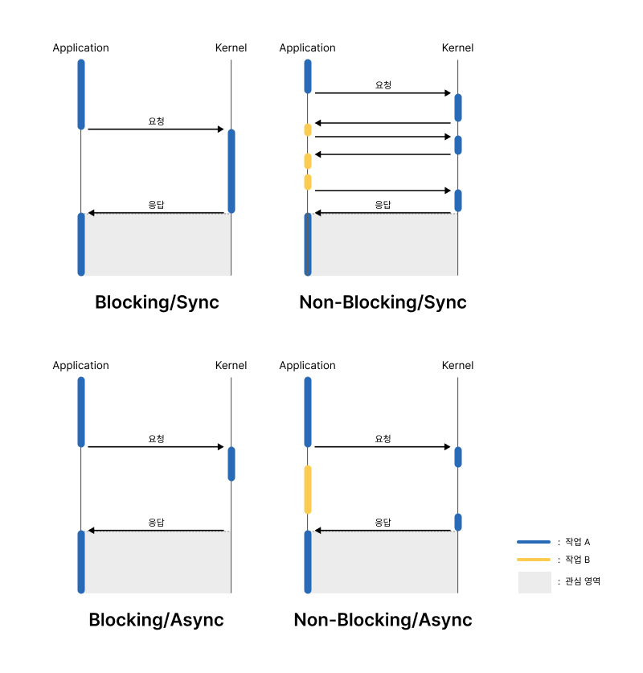

## Synchronorous(동기) vs Asynchronous(비동기)

- 처리해야 하는 작업들의 **수행 프로세스에 대한** 관점으로 접근 **(다른 주체의 작업이 끝나는 시점)**

### Synchronorous와 Asynchronous 구별하기

1. 다른 주체의 작업이 끝나는 시점을 기다렸다가 해당 작업을 시작함
    - == 끝나는 동시에 시작함
    - == **`Synchronorous`**
2. 다른 주체의 작업이 끝나는 시점에 관심이 없음
    - == 끝나는 동시에 시작하지 않음
    - == **`Asynchronorous`**
        
    
        

### 비유를 통해 쉽게 이해하기

- 직원과 상사의 업무 처리
    
    <aside>
    💡 직원(Application)이 상사(Kernel)에게 A 작업에 대한 결재 문서를 올린(Task A) 상황
    
    </aside>
    
    : 이 상사들은 Blocking, Non-Blocking이 아니기 때문에 직원이 기다리거나 다른 일을 해도 신경쓰지 않음
    
    ### 1. Synchronous
    
    - 이 직원은 상사가 서류를 보고 전달해준 결과를 가지고 빠르게 업무를 처리하고자 함
    - 직원은 상사가 서류를 돌려준 시점에 바로 이 업무를 처리
    
    ### 2. Asyncronous
    
    - 이 상사는 해야할 일을 나중에 확인하라고 적어서 보내줌
    - 직원은 나중에 내용을 확인하고 언젠가 처리함

## Blocking/Non-Blocking/Sync/Async 조합

## Total Summary

1. **Blocking/Non-Blocking의 차이점이 뭔가요?**
    - 다른 주체가 작업하고 있을 때 다른 작업을 할 수 있으면 Non-Blocking
    - 다른 주체가 작업하고 있을 때 다른 작업을 할 수 없으면 Blocking
2. **Sync/Async의 차이점이 뭔가요?**
    - 다른 주체의 작업이 끝나는 동시에 해당 작업을 받아서 실행하면 Synchronous
    - 다른 주체의 작업이 끝나도 해당 작업을 실행하지 않으면 Asynchronous
3. **Blocking/Non-Blocking과 Sync/Async의 차이점이 뭔가요?**
    - Blocking/Non-Blocking : 다른 주체가 작업하고 있을 때 제어권의 유무에 따라 나뉨
    - Sync/Async : 다른 주체의 작업이 끝남과 동시에 해당 작업을 실행하는 지 여부에 따라 나뉨