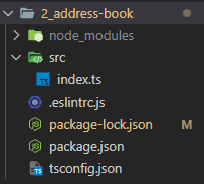

# 11. 전화번호부 앱 (1)

## 11.1. 프로젝트 환경 구성

- 아래 GitHub repository를 fork 뜬 후, 클론
  - [예제코드_GitHub_링크](https://github.com/joshua1988/learn-typescript)
- `2_address-book` 폴더를 vs code로 열고, terminal에서 `npm i`를 입력해서 노드 패키지를 설치했음

<br><br>

## 11.2. 프로젝트 폴더 구조



### 11.2.1. node_modules 폴더

- 프로젝트 실행에 필요한 라이브러리가 설치되는 공간
- `npm i` 명령어로 설치 가능

### 11.2.2. src 폴더

- 프로젝트 실습에 필요한 소스 파일이 있는 폴더

### 11.2.3. .eslintrc.js

- 자바스크립트 확장자로 작성된 ESLint 설정 파일

### 11.2.4. package.json, package-lock.json 파일

- `package.json`: 프로젝트 관련 정보가 담겨 있는 NPM 설정 파일
- `package-lock.json`: NPM 설치 명령어로 필요한 라이브러리를 설치할 때 생성, 변경되는 파일

### 11.2.5. tsconfig.json 파일

- 타입스크립트 관련 설정이 담겨 있는 타입스크립트 설정 파일

```json
{
  "compilerOptions": {
    "allowJs": true,
    "checkJs": true,
    "target": "es5",
    "lib": ["es2015", "dom", "dom.iterable"],
    "noImplicitAny": false
  },
  "include": ["./src/**/*"]
}
```

- `compilerOptions`: 타입스크립트 컴파일과 관련된 옵션 지정
- `allowJs`: 타입스크립트 컴파일 대상에 자바스크립트도 포함할지 정하는 옵션
- `checkJs`: 프로젝트 내 자바스크립트 파일에 타입스크립트 컴파일 규칙을 적용할지 정하는 옵션
- `noImplicitAny`: 타입이 지정되어 있지 않으면 암묵적으로 `any`로 간주할지 설정하는 옵션
- `target`
  - 타입스크립트 코드가 자바스크립트 코드로 컴파일되었을 때 자바스크립트 코드가 실행될 환경 지정
  - `target` 속성을 정하지 않으면 기본값이 ec3으로 설정됨
- `lib`
  - 자바스크립트 기본 문법이나 브라우저 API 등 자주 사용하는 문법에 대해 작성된 타입스크립트 선언 파일의 사용 여부를 정하는 옵션
  - 2015년에 제정된 자바스크립트 문법(ECMAScript 2015)를 사용하겠다는 의미로 `es2015` 지정
  - 브라우저의 DOM 관련 API에 대한 타입인 `dom`, `dom.iterable` 값 추가

<br><br>

## 11.3. 프로젝트 로직

- 소스 코드는 `src` 폴더의 `index.ts` 파일에 작성되어 있음

### 11.3.1. 인터페이스 코드

```typescript
// 타입 정의 코드

interface PhoneNumberDictionary {
  [phone: string]: {
    num: number;
  };
}

interface Contact {
  name: string;
  address: string;
  phones: PhoneNumberDictionary;
}
```

- 전화번호부 연락처 관련 타입을 정의한 코드
`Contact` 인터페이스에 이름, 주소, 전화번호 목록이 정의되어 있고, 전화번호 목록이 `PhoneNumberDictionary`라는 별도의 인터페이스로 정의되어 있음
- `PhoneNumberDictionary` 인터페이스는 속성 이름이 `[phone: string]`이라는 인터페이스의 인덱스 시그니처 문법으로 정의되어 있음
  - 문자열로 정의된 속성은 어떤 이름이든 속성으로 사용할 수 있다는 의미

```typescript
// 예시 객체

var homePhone = {
  home: {
    num: 91099998888
  }
}

var officesPhone = {
  KoreaOffice: {
    num: 91022227777
  },
  USAOffice: {
    num: 91066663333
  }
}
```

- `homePhone`, `officePhone` 객체는 모두 `PhoneNumberDictionary` 인터페이스 타입으로 정의 가능

<br>

### 11.3.2. api 함수

```typescript
// api
// TODO: 아래 함수의 반환 타입을 지정해보세요.
function fetchContacts() {
  // TODO: 아래 변수의 타입을 지정해보세요.
  const contacts = [
    {
      name: 'Tony',
      address: 'Malibu',
      phones: {
        home: {
          num: 11122223333,
        },
        office: {
          num: 44455556666,
        },
      },
    },
    {
      name: 'Banner',
      address: 'New York',
      phones: {
        home: {
          num: 77788889999,
        },
      },
    },
    {
      name: '마동석',
      address: '서울시 강남구',
      phones: {
        home: {
          num: 213423452,
        },
        studio: {
          num: 314882045,
        },
      },
    },
  ];
  return new Promise(resolve => {
    setTimeout(() => resolve(contacts), 2000);
  });
}
```

- 서버에 데이터를 요청하는 API 함수 모방함
- `fetchContacts()`를 호출하면 2초 후 `contacts` 변수에 담긴 배열이 반환됨
- 프로미스(`promise`)라는 자바스크립트 비동기 처리 문법 사용

<br>

### 11.3.3. 전화번호부 클래스

```typescript
class AddressBook {
  // TODO: 아래 변수의 타입을 지정해보세요.
  contacts = [];

  constructor() {
    this.fetchData();
  }

  fetchData() {
    fetchContacts().then(response => {
      this.contacts = response;
    });
  }

  /* TODO: 아래 함수들의 파라미터 타입과 반환 타입을 지정해보세요 */
  findContactByName(name) {
    return this.contacts.filter(contact => contact.name === name);
  }

  findContactByAddress(address) {
    return this.contacts.filter(contact => contact.address === address);
  }

  findContactByPhone(phoneNumber, phoneType: string) {
    return this.contacts.filter(
      contact => contact.phones[phoneType].num === phoneNumber
    );
  }

  addContact(contact) {
    this.contacts.push(contact);
  }

  displayListByName() {
    return this.contacts.map(contact => contact.name);
  }

  displayListByAddress() {
    return this.contacts.map(contact => contact.address);
  }
  /* ------------------------------------------------ */
}

new AddressBook();
```

- 클래스 속성 `contacts`: 클래스에서 전반적으로 조작할 전화번호부 목록이 저장됨
- 클래스 생성자 함수 `constructor()`: 클래스가 `new AddressBook()`으로 초기화되었을 때 `fetchData()`라는 클래스 메서드를 사용하여 전화번호부 데이터를 `contacts` 속성에 저장
- `findContactByName(name)`: 입력받은 이름으로 연락처를 찾는 메서드
- `findContactByAddress(address)`: 주소로 연락처를 찾는 메서드
- `findContactByPhone(phoneNumber, phoneType: string)`: 전화번호와 번호 유형으로 연락처를 찾는 메서드
- `addContact(contact)`: 새 연락처를 전화번호부에 추가하는 메서드
- `displayListByName()`: 전화번호부 목록의 이름만 추출해서 화면에 표시하는 메서드
- `displayListByAddress()`: 전화번호부 목록의 주소를 화면에 표시하는 메서드

<br><br>

## 11.4. 프로젝트 실습

### 11.4.1. 타입스크립트 설정 파일의 nolmplicitAny 속성 값 변경

```json
{
  "compilerOptions": {
    "allowJs": true,
    "checkJs": true,
    "target": "es5",
    "lib": ["es2015", "dom", "dom.iterable"],
    "noImplicitAny": true
  },
  "include": ["./src/**/*"]
}
```

- `tsconfig.json` 파일의 `noImplicitAny` 속성 값을 `true`로 변경
- `index.ts` 파일에서 변수나 함수의 파라미터 타입이 정의되어 있지 않아 타입 에러 발생
- 변수와 함수의 파라미터 타입 정의 방식을 이용하여 에러 해결하기

<br>

### 11.4.2. 타입스크립트 설정 파일의 strict 속성 값 변경

```json
{
  "compilerOptions": {
    "allowJs": true,
    "checkJs": true,
    "target": "es5",
    "lib": ["es2015", "dom", "dom.iterable"],
    "noImplicitAny": true,
    "strict": true
  },
  "include": ["./src/**/*"]
}
```

- `tsconfig.json` 파일의 `strict` 속성을 추가하고, 속성 값을 `true`로 추가
- `strict` 속성
  - 타입스크립트 컴파일러가 타입을 검사할 때 최대한 구체적으로 검사하게 함
  - `null`과 `undefined`의 타입이 같은지 구분하고, 함수의 파라미터나 `this` 바인딩의 타입을 검사하는 등 타입 정의를 최대한 꼼꼼하게 체크

```json
{
  "compilerOptions": {
    "alwaysStrict": true,
    "strctNullChecks": true,
    "strictBindCallApply": true,
    "strictFunctionTypes": true,
    "strictPropertyInitialization": true,
    "noImplicitAny": true,
    "noImplicitThis": true,
    "useUnknownInCatchVariables": true
  }
}
```

- `strict` 속성은 이 속성 8개를 추가한 것과 효과가 같음

<br>

```javascript
module.exports = {
  root: true,
  env: {
    browser: true,
    node: true,
    jest: true,
  },
  extends: [
    'plugin:@typescript-eslint/eslint-recommended',
    'plugin:@typescript-eslint/recommended',
  ],
  plugins: ['prettier', '@typescript-eslint'],
  rules: {
    'prettier/prettier': [
      'error',
      {
        singleQuote: true,
        semi: true,
        useTabs: false,
        tabWidth: 2,
        printWidth: 80,
        bracketSpacing: true,
        arrowParens: 'avoid',
      },
    ],
    // '@typescript-eslint/no-explicit-any': 'off',
    // "@typescript-eslint/explicit-function-return-type": 'off',
    'prefer-const': 'off',
  },
  parserOptions: {
    parser: '@typescript-eslint/parser',
  },
};
```

- `.eslintrc.js` 파일에서 `rules` 속성 아래에 있는 `@typescript-eslint` 관련 규칙 2개 모두 주석 처리
- 이 규칙들은 함수의 반환 타입이 지정되어 있지 않거나 타입이 지정되어야 할 곳에 타입이 없으면 ESLint 에러 발생시킴
- 추가적인 에러를 확인 후 타입 지정해서 해결하기
