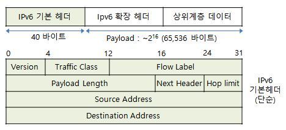

### 3계층 (네트워크 계층)

- 네트워크 계층 (Network Layer)
  
  - 다양한 길이의 패킷을 네트워크를 통해 전달하고 그 과정에서 전송 계층이 요구하는 서비스 품질(QoS)을 위한 수단을 제공하는 계층
  
  - 라우팅, 패킷 포워딩, 인터 네트워킹 (Inter-Networking) 등을 수행

- 네트워크 계층 프로토콜
  
  - IP (Internet Protocol)
    
    - 송수신 간의 패킷 단위로 데이터를 교환하는 네트워크에서 정보를 주고받는데 사용하는 통신 프로토콜

### IPv6

- IPv6 (Internet Protocol version 6)
  
  - IPv4의 주소 고갈, 보안성, 이동성 지원 등의 문제점을 해결하기 위해 개발된 128Bit 주소체계를 갖는 차세대 인터넷 프로토콜

- IPv6의 특징
  
  - IP 주소의 확장
    
    - IPv4의 기존 32비트 주소 공간에서 벗어나 128비트 주소 공간을 제공
  
  - 이동성
    
    - IPv6 호스트는 네트워크의 물리적 위치에 제한받지 않고 같은 주소를 유지하면서도 자유롭게 이동 가능
  
  - 인증 및 보안 기능
    
    - 패킷 출처 인증과 데이터 무결성 및 비밀 보장 기능을 IP 프로토콜 체계에 반영
    
    - IPSec 기능 적용 및 IPv4보다 보안성 강화
  
  - 개선된 QoS 지원
    
    - 흐름 레이블 (Flow Label) 개념을 도입, 특정 트래픽은 별도의 특별한 처리 (실시간 통신 등)를 통해 높은 품질의 서비스를 제공
  
  - Plug&Play 지원
    
    - IPv6 호스트는 IPv6 네트워크에 접속하는 순간 자동적으로 네트워크 주소를 부여받음
    
    - 멀티미디어의 실시간 처리가 가능
  
  - Ad-hoc 네트워크 지원
    
    - Ad-hoc 네트워크를 위한 자동 네트워킹 및 인터넷 연결 지원
    
    - 자동으로 네트워크 환경 구성이 가능
  
  - 단순 헤더 적용
    
    - IP 패킷의 처리를 신속하게 할 수 있도록 고정 크기의 단순 헤더를 사용하는 동시에 확장 헤더를 통해 기능에 대한 확장 및 옵션 기능의 사용이 용이한 구조
  
  - 실시간 패킷 추적 기능
    
    - 흐름 레이블 (Flow Label)을 사용하여 패킷의 흐름을 실시간으로 제공

- IPv6 헤더
  
  - 기존 IPv4 헤더에 비해 출발지 주소, 목적지 주소의 주소 길이로 인하여 길이가 커짐
  
  - 기존 IPv4 헤더의 불필요한 필드를 제거하여 헤더가 단순해짐
  
  

- IPv6 주소체계
  
  - 128비트의 주소 공간 제공
    
    - 2^128  즉, 대략 3.4*10^38개의 주소를 갖고 있어 거의 무한대로 사용 가능
    
    - 주소 공간은 16비트를 16진수로 표현하여 8자리로 나타냄
    
    - 주소 범위
      
      - 0000:0000:0000:0000:0000:0000:0000:0000에서 ffff:ffff:ffff:ffff:ffff:ffff:ffff:ffff
      
      - 대부분의 자리가 0의 숫자를 갖게 되므로 0000을 0으로 축약하거나 맨 앞자리의 0도 생략 가능
      
      - 아예 연속되는 0의 그룹을 없애고 :만 남길 수도 있음
        
        - 0을 축약하고 :로 없애는 규칙은 두 번 이상 적용할 수 없음
  
  - 일반적으로 16비트 단위로 나누어지며 각 16비트 블록은 다시 4자리 16진수로 변환되며 콜론으로 구분됨
  
  - 128비트 중 앞 64비트를 네트워크 주소로, 뒤 64비트를 인터페이스 주소로 활용