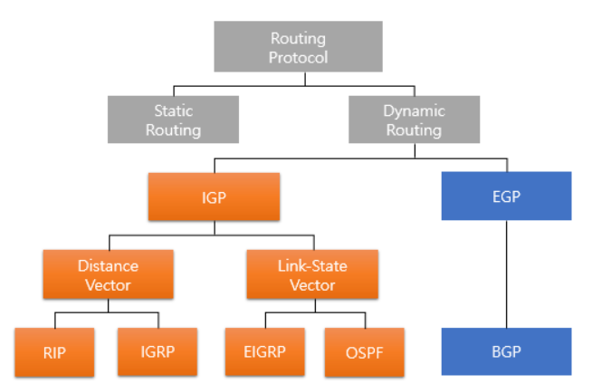

### 3계층 (네트워크 계층)

- 네트워크 계층 (Network Layer)
  
  - 다양한 길이의 패킷을 네트워크를 통해 전달하고 그 과정에서 전송 계층이 요구하는 서비스 품질(QoS)을 위한 수단을 제공하는 계층
  
  - 라우팅, 패킷 포워딩, 인터 네트워킹 (Inter-Networking) 등을 수행

### 라우팅 프로토콜 (Routing Protocol)

- 데이터 전송을 위해 목적지까지 갈 수 있는 여러 경로 중 최적의 경로를 설정해주는 라우터 간의 상호 통신 프로토콜

- 라우팅
  
  - 정적 라우팅
    
    - 패킷 전송이 이루어지기 전에 경로 정보를 라우터가 미리 저장하여 중개하는 방식
  
  - 동적 라우팅
    
    - 라우터의 경로 정보가 네트워크 상황에 따라 동적으로 변경되어 중개하는 방식
    
    - 내부 라우팅 프로토콜 (IGP; Interior Gateway Protocol)
      
      - 동일한 AS 내의 라우팅에 사용되는 프로토콜
      
      - Distance-Vector 방식
        
        - RIP (Routing Information Protocol)
          
          - AS (Autonomous System; 자율 시스템) 내에서 사용하는 거리 벡터 (Distance-Vector) 알고리즘에 기초하여 개발된 내부 라우팅 프로토콜
          
          - 특징
            
            - 벨만-포드 알고리즘 사용
              
              - 거리 벡터 라우팅 기반 메트릭 정보를 인접 라우터와 주기적으로 교환하여 라우팅 테이블을 갱신하고 라우팅 테이블을 구성, 계산
            
            - 15홉 제한
              
              - 최대 홉 수를 15개로 제한
                
                - 홉 (Hop)
                  
                  - 데이터가 목적지까지 전달되는 과정에서 거치는 네트워크의 수
            
            - UDP 사용
              
              - UDP 포트 번호 520 사용
            
            - 30초마다 정보 공유
              
              - 30초마다 전체 라우팅 정보를 브로드캐스팅
        
        - IGRP
      
      - Linked-State 방식
        
        - OSPF (Open Shortest Path First)
          
          - 규모가 크고 복잡한 TCP/IP 네트워크에서 RIP의 단점을 개선하기 위해 자신을 기준으로 링크 상태 (Link-State) 알고리즘을 적용하여 최단 경로를 찾는 라우팅 프로토콜
          
          - 특징
            
            - 다익스트라 알고리즘 사용
              
              - 최단 경로 탐색에 다익스트라 알고리즘을 사용하는 내부 라우팅 프로토콜
              
              - 링크 상태 라우팅 기반 메트릭 정보를 한 지역 내 모든 라우터에 변경이 발생했을 때만 보내고 라우팅 테이블을 구성, 계산
              
              - 네트워크 변화에 신속하게 대처
            
            - 라우팅 메트릭 지정
              
              - 최소 지연, 최대 처리량 등 관리자가 라우팅 메트릭 지정
            
            - AS 분할 사용
              
              - 자치 시스템을 지역으로 나누어 라우팅을 효과적으로 관리
            
            - 홉 카운트 무제한
              
              - 홉 카운트에 제한이 없음
            
            - 멀티캐스팅 지원
              
              - 멀티캐스트를 사용하여 정보를 전달
        
        - EIGRP
    
    - 외부 라우팅 프로토콜 (EGP; Exterior Gateway Protocol)
      
      - 서로 다른 AS 간 라우팅 프로토콜로 게이트웨이 간의 라우팅에 사용되는 프로토콜
      
      - Path-Vector 방식
        
        - BGP (Border Gateway Protocol)
          - AS 상호 간에 경로 정보를 교환하기 위한 라우팅 프로토콜
          
          - 특징
            
            - 변경 발생 시 대상까지의 가장 짧은 경로를 경로 벡터 (Path Vector) 알고리즘을 통해 선정하고 TCP 연결을 통해 자치 시스템으로 라우팅 정보를 신뢰성 있게 전달
            
            - ISP 사업자들 상호 간에 주로 사용되는 라우팅 프로토콜
            
            - 순환을 피할 수 있도록 목적지까지 가는 경로 정보를 제공
            
            - 라우팅 비용 (CPU 부하)이 많이 들고, 라우팅 테이블의 크기가 커서 메모리 사용량이 많음

- 라우팅 알고리즘
  
  - 목적지까지의 최적 경로를 산출하기 위한 법칙
  
  - 유형
    
    - 거리 벡터 알고리즘 (Distance Vector Algorithm)
      
      - 인접 라우터와 정보를 공유하여 목적지까지의 거리와 방향을 결정하는 라우팅 프로토콜 알고리즘
      
      - 벨만-포드 알고리즘 사용
      
      - 각 라우터가 업데이트 될 때마다 전체 라우팅 테이블을 보내라고 요청하지만 수신된 경로 비용 정보는 이웃 라우터에게만 보내짐
    
    - 링크 상태 알고리즘 (Link State Algorithm)
      
      - 링크 상태 정보를 모든 라우터에 전달하여 최단 경로 트리를 구성하는 라우팅 프로토콜 알고리즘
      
      - 다익스트라 알고리즘 사용
      
      - 네트워크를 일관성있게 파악할 수 있으나 거리 벡터 알고리즘에 비하여 계산이 더 복잡하고 트래픽을 광범위한 범위까지 전달