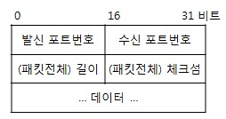

### 4계층 (전송 계층)

- 전송 계층 (Transport Layer)
  
  - 상위 계층이 데이터 전달의 유효성이나 효율성을 생각하지 않도록 해주면서 종단 간의 사용자들에게 신뢰성 있는 데이터를 전달하는 계층
  
  - 순차 번호 기반의 오류 제어 방식을 사용하고 종단 간 통신을 다루는 최하위 계층으로 종단 간 신뢰성 있고 효율적인 데이터를 전송

- 전송 계층 프로토콜
  
  - TCP (Transmission Control Protocol)
    
    - 개념
      
      - 인터넷 프로토콜 스위트의 핵심 프로토콜 중 하나로 IP와 함께 TCP/IP 라는 명칭으로 사용됨
      
      - 근거리 통신망이나 인트라넷, 인터넷에 연결된 컴퓨터에서 실행되는 프로그램 간에 일련의 옥텟을 안정적으로, 순서대로, 에러 없이 교환할 수 있게 해주는 프로토콜
    
    - 특징
      
      - 신뢰성 보장
        
        - 패킷 손실, 중복, 순서 바뀜 등이 없도록 보장
        
        - TCP 하위 계층인 IP 계층의 신뢰성 없는 서비스를 보완하여 신뢰성 제공
      
      - 연결 지향적 특징
        
        - 양단간 애플리케이션/프로세스는 TCP가 제공하는 연결성 회선을 통하여 서로 통신
      
      - 흐름 제어 (Flow Control)
        
        - 송신 (송신 전송률) 및 수신 (수신 처리율) 속도를 일치시킴
      
      - 혼잡 제어 (Congestion Control)
        
        - 네트워크가 혼잡하다고 판단하면 송신율을 감속함
    
    - 헤더 구조
      
      
      
      - Options and Padding을 생략하는 경우 TCP 헤더의 크기는 20바이트
      
      - Options 필드는 다양한 종류의 부가 정보를 전달하는 데 사용하며, 최대 40 바이트의 크기 지원
      
      - Padding 필드는 헤더의 크기를 4바이트 단위로 맞추려고 사용
      
      | 헤더 구조                  | 설명                                                                 | 크기     |
      | ---------------------- | ------------------------------------------------------------------ | ------ |
      | 발신지 포트 주소 / 목적지 포트 주소  | 양쪽 호스트 내 종단 프로세스 식별                                                | 각 16비트 |
      | Sequence Number        | 바이트 단위로 구분되어 순서화되는 번호                                              | 32비트   |
      |                        | 이를 통해 신뢰성 및 흐름 제어 기능 제공                                            |        |
      | Acknowledgement Number | 확인응답번호/승인번호                                                        | 32비트   |
      |                        | 상대편 호스트에서 받으려는 바이트 번호 정의                                           |        |
      | HLEN (Header Length)   | TCP 헤더 길이를 4바이트 (32비트) 단위로 표시                                      | 4비트    |
      | Flag Bit               | TCP 회선 및 데이터 관리 제어 기능을 하는 플래그                                      | 6비트    |
      |                        | TCP 연결 설정과 연결 해제 메시지를 구분                                           |        |
      |                        | URG, ACK, PSH, RST, SYN, FIN으로 구성                                  |        |
      | Window Size            | 해당 세그먼트의 송신 측이 현재 수신하고자 하는 윈도우 크기                                  | 16비트   |
      |                        | 송수신 측의 버퍼  크기로 전체 16비트로 되어있고 2^16까지 표시할 수 있기 때문에 최대 크기는 65,535바이트임 |        |
      | Checksum               | 헤더 및 데이터의 에러 확인을 위해 사용되는 16비트 체크섬 필드                               | 16비트   |
      |                        | 데이터를 포함한 세그먼트의 오류를 검사                                              |        |
      | Urgent Pointer         | URG 플래그가 설정된 경우, 시퀀스 번호로부터의 오프셋을 나타냄                               | 16비트   |
      | Options and Padding    | 최대 40 바이트까지 옵션 데이터 포함 가능                                           |        |
  
  - UDP (User Diagram Protocol)
    
    - 개념
      
      - 비연결성이고, 신뢰성이 없으며, 순서화되지 않은 데이터그램 서비스를 제공하는 프로토콜
    
    - 특징
      
      - 비신뢰성
        
        - 데이터그램 지향의 전송계층용 프로토콜
          
          - 논리적인 가상회선 연결이 필요 없음
        
        - 메시지가 제대로 도착했는지 확인하지 않음
        
        - 검사 합을 제외한 특별한 오류 검출 및 제어 없음
          
          - 오류 제어 거의 없음
      
      - 순서화되지 않은 데이터그램 서비스 제공
        
        - 수신된 메시지의 순서를 맞추지 않음
        
        - 흐름 제어를 위한 피드백을 제공하지 않음
      
      - 실시간 응용 및 멀티캐스팅 가능
        
        - 빠른 요청과 응답이 필요한 실시간 응용에 적합
        
        - 여러 다수 지점에 전송 가능
      
      - 단순 헤더
        
        - 고정 크기의 8바이트만 사용
        
        - 헤더 처리에 시간과 노력이 필요하지 않음
    
    - 헤더 구조
      
      
      
      - 데이터 그램의 신뢰성을 보장하지 않음
      
      | 필드         | 설명                                   | 크기   |
      | ---------- | ------------------------------------ | ---- |
      | 발신 포트번호    |                                      | 16비트 |
      | 수신 포트번호    | 선택 항목 (사용하게 되면 응답받게 될 포트 표시)         | 16비트 |
      | (패킷전체) 길이  | 바이트 단위의 길이                           | 16비트 |
      |            | 최솟값 8 (헤더만 포함될 때)                    |      |
      | (패킷전체) 체크섬 | 헤더 및 데이터의 에러 확인을 위해 사용되는 필드          | 16비트 |
      |            | 선택 항목 (체크섬 값이 0이면 수신 측은 체크섬 계산하지 않음) |      |
      | 데이터        | 가변 길이 데이터                            | 가변   |