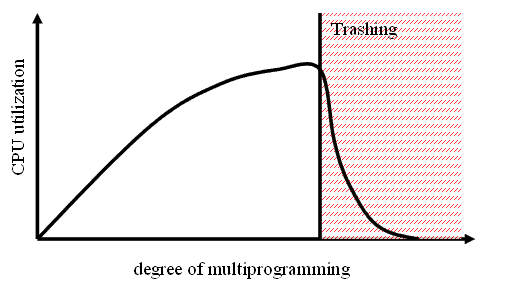

### 운영체제 핵심 기능

- 운영체제
  
  - 중앙처리장치, 메모리, 스토리지, 주변 기기 등을 적절히 관리
  
  - 초기에는 메모리 용량에 제한이 많아 소프트웨어 개발 시 메모리 관리가 매우 중요했으나, 최근에는 운영체제에서 대부분 자동으로 관리해주어 편리해짐
  
  - 개발 및 시스템 환경이 클라우드화되면서 자원에 대한 관리 노력이 줆

- 메모리 관리
  
  - 프로그램의 실행이 종료될 때까지 메모리를 가용한 상태로 유지 및 관리하는 기능
  
  - 프로그램 실행 중 메모리가 꽉 차게 되면 시스템의 속도가 느려지고 때로는 시스템이 멈추는 현상이 발생
  
  - 메모리에 있는 프로그램은 CPU로 이동하여 처리
    
    - CPU는 가상 주소, 메모리는 물리주소를 사용하는데 MMU가 주소를 매핑하는 역할 수행
      
      - MMU (Memory Management Unit)
        
        - CPU가 메모리에 접근하는 것을 관리하는 컴퓨터 하드웨어 부품
        
        - 가상 메모리 주소를 실제 메모리 주소로 변환하는 장치

### 메모리 관리

- 메모리 단편화
  
  - 분할된 주기억장치에 프로세스를 할당, 반납 과정에서 사용되지 못하고 낭비되는 기억장치가 발생하는 현상
  
  - 유형
    
    - 내부 단편화
      
      - 개념
        
        - 분할된 공간에 프로세스를 적재한 후 남은 공간
        
        - `고정 분할 할당 방식 또는 페이징 기법` 사용 시 발생하는 메모리 단편화
      
      - 해결방안
        
        - Slab Allocator
          
          - 페이지 프레임을 할당받아 공간을 작은 크기고 분할하고 메모리 요청 시 작은 크기로 메모리를 할당/해제하는 동적 메모리 관리 기법
        
        - 통합 (Coalescing)
          
          - 인접한 단편화 영역을 찾아 하나로 통합하는 기법
        
        - 압축 (Compaction)
          
          - 메모리의 모든 단편화 영역을 하나로 압축하는 기법
    
    - 외부 단편화
      
      - 개념
        
        - 할당된 크기가 프로세스 크기보다 작아서 사용하지 못하는 공간
        
        - `가변 분할 할당 방식 또는 세그먼테이션 기법` 사용 시 발생하는 메모리 단편화
      
      - 해결방안
        
        - 버디 메모리 할당 (Buddy Memory Allocation)
          
          - 요청한 프로세스 크기에 가장 알맞은 크기를 할당하기 위해 메모리를 2n의 크기로 분할하여 메모리를 할당하는 기법
        
        - 통합, 압축

- 페이징 기법의 문제 및 해결방안
  
  - 문제
    
    - 스레싱 (Thrashing)
      
      
      
      - 어떤 프로세스가 계속적으로 페이지 부재가 발생하여 프로세스의 실제 처리  시간보다 페이지 교체 시간이 더 많아지는 현상
      
      - 오류율이 클수록 스레싱이 많이 발생
        
        - 스레싱으로 인해 전체 시스템의 성능 및 처리율은 저하
      
      - 페이지 부재가 계속 증가하여 기억장치 접근 시간이 증가
  
  - 해결방안
    
    - 워킹 세트 (Working Set)
      
      - 각 프로세스가 많이 참조하는 페이지의 집합을 주기억장치 공간에 계속 상주하게 하여 빈번한 페이지 교체 현상을 줄이고자 하는 기법
      
      - 장점
        
        - 멀티 프로그래밍 정도를 높일 수 있고 (Page Hit 증가), CPU 활용률을 최적화할 수 있음
      
      - 단점
        
        - 워킹 세트 추적 관리가 복잡하고, 워킹 세트 크기 설정의 모호함이 발생
    
    - 페이지 부재 빈도 (PFF; Page-Fault Frequency)
      
      - 페이지 부재율의 상한과 하한을 정해서 직접적으로 페이지 부재율을 예측하고 조절하는 기법
      
      - 페이지 부재 비율에 따라 페이지 프레임 개수 조절
      
      - 장점
        
        - 페이지  부재 발생 시 실행하여 부하가 적고, 직접적으로 페이지 부재율 조절 가능
      
      - 단점
        
        - 프로세스를 중지시키는 과정 발생, 페이지 참조가 새로운 지역성으로 이동할 수 있음

- 지역성 (Locality)
  
  - 개념
    
    - 프로세스가 실행되는 동안 주기억장치를 참조할 때 일부 페이지만 집중적으로 참조하는 특성
    
    - 프로세스가 집중적으로 사용하는 페이지를 알아내는 방법 중 하나로 가상기억장치 관리의 이론적인 근거가 됨
    
    - 스레싱을 방지하기 위한 워킹 셋 이론의 기반
    
    - 지역성을 활용하여 기억, 저장 장치의 계층적 구조와 캐시 메모리, 가상 메모리의 기법으로 효율성의 극대화 가능
  
  - 유형
    
    - 시간 (Temporal) 지역성
      
      - 최근 사용되었던 기억장소에 집중적으로 액세스하는 현상
      
      - 참조했던 메모리를 빠른 시간에 다시 참조될 확률이 높은 특성
    
    - 공간 (Spatial) 지역성
      
      - 프로세스 실행 시 일정 위치의 페이지를 집중적으로 액세스하는 현상
      
      - 참조된 메모리 근처의 메모리를 참조하는 특성
    
    - 순차 (Sequential) 지역성
      
      - 데이터가 순차적으로 액세스되는 현상
      
      - 프로그램 내의 명령어가 순차적으로 구성된 특성
      
      - 공간 지역성에 편입되어 설명되기도 함