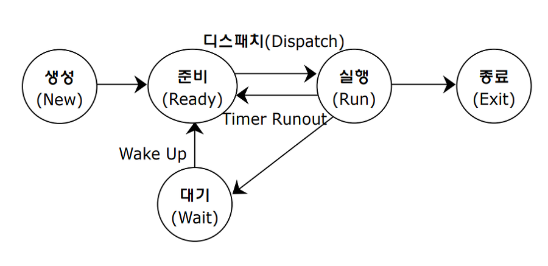

### 운영체제 핵심 기능

- 운영체제
  
  - 중앙처리장치, 메모리, 스토리지, 주변 기기 등을 적절히 관리
  
  - 초기에는 메모리 용량에 제한이 많아 소프트웨어 개발 시 메모리 관리가 매우 중요했으나, 최근에는 운영체제에서 대부분 자동으로 관리해주어 편리해짐
  
  - 개발 및 시스템 환경이 클라우드화되면서 자원에 대한 관리 노력이 줆

### 프로세스 관리

- 프로세스 (Process)
  
  - 일반적으로 CPU에 의해 처리되는 프로그램으로 현재 실행 중인 프로그램
  
  - 작업 (Job) 또는 태스크 (Task)라고도 함

- 프로세스 상태
  
  - 하나의 프로세스는 여러 가지 이벤트에 의해 일련의 서로 구분되는 상태 변화를 겪음
  
  - 생성 (Create) 상태
    
    - 사용자에 의해 프로세스가 생성된 상태
  
  - 준비 (Ready) 상태
    
    - CPU를 할당받을 수 있는 상태
    
    - 준비 리스트 (Ready List)
      
      - 각각 우선순위를 부여하여 가장 높은 우선순위를 갖는 프로세스가 다음 순서에 CPU를 할당 받음
  
  - 실행 (Running) 상태
    
    - 프로세스가 CPU를 할당받아 동작 중인 상태
  
  - 대기 (Waiting) 상태
    
    - 프로세스 실행 중 입출력 처리 등으로 인해 CPU를 양도하고 입출력 처리가 완료될 때까지 대기 리스트에서 기다리는 상태
    
    - 대기 리스트 (Waiting List)
      
      - 우선순위가 존재하지 않음
  
  - 완료 (Complete) 상태
    
    - 프로세스가 CPU를 할당받아 주어진 시간 내에 완전히 수행을 종료한 상태

- 프로세스 상태 전이
  
  - 하나의 작업이 컴퓨터 시스템에 입력되어 완료되기까지 프로세스의 상태가 준비, 실행 및 대기 상태로 변하는 활동
  
  
  
  - 디스패치 (Dispatch)
    
    - 준비 상태에 있는 여러 프로세스 (Ready List) 중 실행될 프로세스를 선정 (Scheduling)하여 CPU를 할당 (Dispatch)
      
      - Context switching 발생
        
        - Context switching
          
          - CPU가 현재 실행하고 있는 프로세스의 문맥 상태를 프로세스 제어블록 (PCB)에 저장하고 다음 프로세스의 PCB로부터 문맥을 복원하는 작업
    
    - 프로세스는 `준비 상태에서 실행 상태로` 전이
  
  - 타이머 런 아웃 (Timer Runout)
    
    - 할당 시간 초과
    
    - CPU를 할당받은 프로세스는 지정된 시간이 초과되면 스케줄러에 의해 PCB 저장, CPU 반납 후 다시 준비 상태로 전이됨
    
    - 프로세스는 `실행 상태에서 준비 상태로` 전이
    
    - 타임 슬라이스 만료, 선점 시 타임아웃 발생
  
  - 블록 (Block)
    
    - 입출력 발생
    
    - 실행 상태에 있는 프로세스가 지정된 할당시간을 초과하기 전에 입출력이나 기타 사건이 발생 (block)하면 CPU를 스스로 반납하고 입출력이 완료될 때까지 대기 상태로 전이됨
    
    - 프로세스는 `실행 상태에서 대기 상태로` 전이
    
    - 즉시 실행 불가능한 시스템 콜, I/O 작업 시작, 프로세스 간 통신 시 Block 발생
  
  - 웨이크 업 (Wake-up)
    
    - 어느 순간에 입출력이 종료되면 대기 상태의 프로세스에게 입출력 종료 사실을 wait&signal 등을 통해 알려주고 준비 상태로 전이됨
    
    - 프로세스는 `대기 상태에서 준비 상태로` 전이