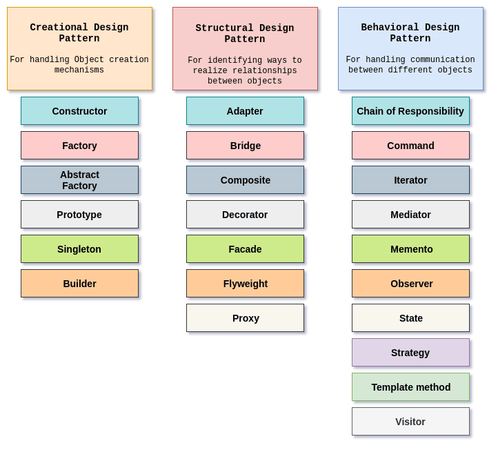

# [JavaScript] 디자인 패턴

## 1. 디자인 패턴이란?

- 기존 환경 내에서 반복적으로 일어나는 문제들을 어떻게 풀어나갈 것인가에 대한 일종의 솔루션
- 개발자들끼리 협업을 잘 할 수 있도록 코드들의 패턴을 짜고, 코드의 질과 효율성을 높이는 것

<br>

## 2. 디자인 패턴의 장점과 단점

- 장점

  - 개발자 간의 원활한 의사소통
  - 소프트웨어 구조 파악 용이
  - 재사용을 통한 개발 시간 단축
  - 불필요한 리소스 낭비 방지

- 단점
  - 객체 지향 설계/구현 위주로 사용됨
  - 초기 투자 비용 부담

<br>

## 3. 디자인 패턴의 유형

- Creation Pattern
  - 객체의 생성과 관련된 패턴
  - 객체의 생성 로직을 숨김으로써 유연성을 향상시킴
- Structural Pattern
  - 클래스와 객체의 구성에 관련된 패턴
- Behavioral Pattern
  - 객체와 객체 간의 통신에 관련된 패턴

<br>

## 4. 디자인 패턴의 종류



<br>

### 4.1. 싱글톤 패턴

- 특정 클래스의 객체를 한 개만 유지하는 패턴
- 자바스크립트에서는 이미 객체 리터럴을 이용한 객체 생성 방법이 실글톤 패턴과 동일함

```javascript
var obj = {
  myprop: "my value",
};

var obj2 = {
  myprop: "my value",
};

obj === obj2; // false
obj == obj2; // false
```

<br>

### 4.2. 팩토리 패턴

- 비슷한 객체를 공장에서 찍어내듯이 반복적으로 생성할 수 있게 하는 패턴
- 컴파일 시점에 구체적인 타입(클래스)을 몰라도 객체 생성이 가능
- 팩토리 패턴의 가장 흔한 사례는 `Object()`를 이용한 객체 생성시, 주어지는 값의 타입에 따라 `String`, `Boolean`, `Number` 등으로 객체가 생성되는 것

```javascript
// 팩토리 패턴 구현 예제
function CarMaker() {}
CarMaker.prototype.drive = function () {
  return "Vroom, I have" + this.doors + "doors";
};

CarMaker.fectory = function (type) {
  var constr = type,
    newcar;

  // 생성자가 존재하지 않으면 에러발생
  if (typeof CarMaker[constr] !== "function") {
    throw {
      name: "Error",
      message: constr + "doesn``t exist",
    };
  }

  // 생성자 존재 확인 후 부모 상속
  if (typeof Carmaker[constr].prototype.drive !== "function") {
    CarMaker[constr].prototype = new CarMaker();
  }

  newcar = new CarMaker[constr]();

  return newcar;
};

CarMaker.Compact = function () {
  this.doors = 4;
};

CarMaker.Convertible = function () {
  this.doors = 2;
};

CarMaker.SUV = function () {
  this.doors = 24;
};

// 위 패턴을 이용한 결과
var corolla = CarMaker.fectory("Compact");
var solstice = CarMaker.fectory("Convertible");
corolla.drive(); // 'Vroom, I have 4 doors'
solstice.drive(); // 'Vroom, I have 2 doors'
```

<br>

### 4.3. Iterator 패턴

- 객체의 내부구조가 복잡하더라도 개별 속성에 쉽게 접근하기 위한 패턴

```javascript
var element;
while ((element = agg.next())) {
  // ...
  console.log(element);
}
```

- 위의 `agg` 객체 구현방법은 아래와 같음

  ```javascript
  var agg = function () {
    var index = 0,
      data = [1, 2, 3, 4, 5],
      length = data.length;

    return {
      next: function () {
        var element;

        if (!this.hasNext()) {
          return null;
        }

        element = data[index];
        index += 1;
        return element;
      },
      hasNext: function () {
        return index < length;
      },
      rewind: function () {
        index = 0;
      },
      current: function () {
        return data[index];
      },
    };
  };
  ```

<br>

### 4.4. Decorator 패턴

- 런타임시 객체에 동적으로 부가기능을 추가할 수 있는 패턴
- 예제는 아래와 같음

```javascript
var sale = new Sale(100);
sale = sale.decorate("fedtax");
sale = sale.decorate("quebec");
sale = sale.decorate("money");
sale.getPrice(); // $112.88
```

- 구현 예제는 아래와 같음

```javascript
function Sale(price) {
  this.price = price || 100;
}

Sale.prototype.getPrice = function () {
  return this.price;
};

Sale.decorators = {};
Sale.decorators.fedtax = {
  getPrice: function () {
    var price = this.uber.getPrice(); // uber 는 상속된 객체
    price += (price * 5) / 100; // 5% 세율 추가

    return price;
  },
};

Sale.decorators.money = {
  getPrice: function () {
    return "$" + this.uber.getPrice().toFixed(2);
  },
};
```

- 위의 `decorators()`를 아래와 같이 구현 가능

```javascript
Sale.prototype.decorate = function (decorators) {
  var F = function () {},
    overrides = this.constructor.decorators[decorator],
    i,
    newobj;
  F.prototype = this;
  newobj = new F();
  newobj.uber = F.prototype;
  for (i in overrides) {
    if (overrides.hasOwnProperty(i)) {
      newobj[i] = overrides[i];
    }
  }
  return newobj;
};
```

<br>

### 4.5. 프록시 패턴

- Lazy Initialization(게으른 초기화)로 어플리케이션의 부하를 줄여줌

```javascript
var $ = function(id) {
	return document.getElementById(id);
}

$('vids').onclick = function(e) {
  var src, id;

  e = e || window.event;
  src = e.target || e.srcElement;

  if (srec.nodeName !== 'A') {
  	return;
  }

  if (type of e.preventDefault() === 'function') {
  	e.preventDefault();
  }

  e.returnValue = false;
  id = src.href.split('--')[1];

  if (src.className === 'play') {
  	src.parentNode.innerHTML = videos.getPlayer(id);
    return;
  }

  src.parentNode.id = 'v' + id;
  videos.getInfo(id);
};
```

- 위와 같이 클릭 이벤트에 대해서 이벤트 핸들링이 가능
- 아래는 Proxy를 이용하여 HTTP 라운드 트립을 줄일 수 있는 코드

```javascript
var proxy = {
  ids: [],
  delay: 50,
  timeout: null,
  callback: null,
  context: null,

  makeRequest: function (id, callback, context) {
    this.ids.push(id);

    this.callback = callback;
    this.context = context;

    if (!this.timeout) {
      this.timeout = setTimeout(function () {
        proxy.flush();
      }, this.delay);
    }
  },
  flush: function () {
    http.makeRequest(this.ids, "proxy.handler:");
    this.timeout = null;
    this.ids = [];
  },
  handler: function (data) {
    var i, max;
    if (parseInt(data, query, count, 10) === 1) {
      proxy.callback.call(proxy.context, data.query.results.Video);
      return;
    }

    for (i = 0, max = data.query.results.Video.length; i < max; i += 1) {
      proxy.callback.call(proxy.context, data.query.results.Video[i]);
    }
  },
};
```

- HTTP 요청이 50 밀리 세컨 이내로 일어난다면, 각각 보낼 것이 아니라 `setTimeout()`을 이용하여 요청을 잠시 보류한 후 한 번에 보냄
- 그렇게 되면 HTTP의 라운드 트립 횟수가 줄어들기 때문에 전체적으로 성능이 향상됨

<br>

### 4.6. Mediator 패턴

- 객체 간의 영향도(결합도)가 높은 상태에서는 어플리케이션의 리팩토링이 예기치 않은 결과를 나을 수 있음
- 따라서 결합도를 낮추기 위해 객체의 상태가 변경되면 Mediator에게 먼저 전달하고 이를 Mediator가 다른 객체에 전달하는 방식의 코딩이 가능

<br>

### 4.7. Observer 패턴

- 클라이언트 측 자바스크립트 프로그래밍에서 널리 사용되는 패턴
- subscriber / publisher 패턴이라고도 함
- 주요 목적은 객체간의 결합도를 낮추는 것
