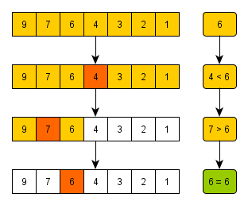

# 이진 탐색 (1)

## 1. 범위를 반씩 좁혀가는 탐색

### 1.1. 순차 탐색(Sequential Search)

- **리스트 안에 있는 특정한 데이터를 찾기 위해 앞에서부터 데이터를 하나씩 차례대로 확인하는 방법**
- 보통 정렬되지 않은 리스트에서 데이터를 찾아야 할 때 사용
- 장점: 리스트 내에 데이터가 아무리 많아도 시간만 충분하다면 항상 원하는 원소(데이터)를 찾을 수 있음
- 순차로 데이터를 탐색

```javascript
const readline = require("readline");

const rl = readline.createInterface({
  input: process.stdin,
  output: process.stdout,
});

// 순차 탐색 소스코드 구현
function sequentialSearch(n, target, array) {
  // 각 원소를 하나씩 확인하며
  for (let i = 0; i < n; i++) {
    // 현재의 원소가 찾고자 하는 원소와 동일한 경우
    if (array[i] === target) {
      return i + 1; // 현재의 위치 반환(인덱스는 0부터 시작하므로 1 더하기)
    }
  }
}

rl.question(
  "생성할 원소 개수를 입력한 다음 한 칸 띄고 찾을 문자열을 입력하세요.\n",
  (inputData) => {
    // 원소의 개수, 찾고자 하는 문자열
    const [n, target] = inputData
      .split(" ")
      .map((item) => (isNaN(item) ? item : parseInt(item)));

    rl.question(
      "앞서 적은 원소의 개수만큼 문자열을 입력하세요. 구분은 띄어쓰기 한 칸으로 합니다.\n",
      (arrayInput) => {
        const array = arrayInput.split(" ");

        console.log(sequentialSearch(n, target, array));
        rl.close();
      }
    );
  }
);
```

```bash
생성할 원소 개수를 입력한 다음 한 칸 띄고 찾을 문자열을 입력하세요
5 Yerin
앞서 적은 원소의 개수만큼 문자열을 입력하세요. 구분은 띄어쓰기 한 칸으로 합니다.
Wonjun Gdragon Yerin Taemin Jongmin
3
```

<br>

- 순차탐색은 데이터 정렬 여부와 상관없이 가장 앞에 있는 원소부터 하나씩 확인해야 한다는 점이 특징
- 데이터의 개수가 `N`개일 때 최대 `N`번의 비교 연산이 필요하므로 순차 탐색의 최악의 경우 시간 복잡도는 `O(N)`

<br><br>

### 1.2. 이진 탐색(Binary Search) : 반으로 쪼개면서 탐색하기



- 배열 내부의 데이터가 정렬되어 있어야만 사용할 수 있는 알고리즘

- 특징

  - 데이터가 무작위일 때는 사용할 수 없지만, 이미 정렬되어 있다면 매우 빠르게 데이터를 찾을 수 있음
  - 탐색 범위를 절반씩 좁혀가며 데이터를 탐색

- 위치를 나타내는 변수 3개를 사용하는데 탐색하고자 하는 범위의 **시작점**, **끝점**, **중간점**
- **찾으려는 데이터와 중간점(Middle) 위치에 있는 데이터를 반복적으로 비교**해서 원하는 데이터를 찾음
- 중간점이 실수일 때는 소수점 이하를 버림

<br>

- 한 번 확인할 때마다 확인하는 원소의 개수가 절반씩 줄어든다는 점에서 시간 복잡도가 `O(logN)`

<br>

- 이진 탐색을 구현하는 방법은 **재귀 함수를 이용하는 방법**과 **단순하게 반복문을 이용하는 방법**이 있음

```javascript
// 이진 탐색 소스코드 구현(재귀 함수)
function binarySearch(array, target, start, end) {
  if (start > end) return null;

  const mid = Math.floor((start + end) / 2);
  // 찾은 경우 중간점 인덱스 반환
  if (array[mid] === target) return mid;
  // 중간점의 값보다 찾고자 하는 값이 작은 경우 왼쪽 확인
  else if (array[mid] > target)
    return binarySearch(array, target, start, mid - 1);
  // 중간점의 값보다 찾고자 하는 값이 큰 경우 오른쪽 확인
  else return binarySearch(array, target, mid + 1, end);
}

// n(원소의 개수)과 target(찾고자 하는 값)을 입력 받기
const inputValues = prompt(
  "원소의 개수와 찾고자 하는 값을 입력해주세요. 예: 5 3"
)
  .split(" ")
  .map(Number);
const n = inputValues[0];
const target = inputValues[1];

// 전체 원소 입력 받기
const array = prompt("전체 원소 값을 입력해주세요. 예: 1 2 3 4 5")
  .split(" ")
  .map(Number);

// 이진 탐색 수행 결과 출력
const result = binarySearch(array, target, 0, n - 1);
if (result === null) {
  console.log("원소가 존재하지 않습니다.");
} else {
  console.log(result + 1);
}
```

```bash
10 7
1 3 5 7 9 11 13 15 17 19
4
```

```bash
10 7
1 3 5 6 9 11 13 15 17 19
원소가 존재하지 않습니다.
```

<br>

```javascript
// 이진 탐색 소스코드 구현 (반복문)
function binarySearch(array, target, start, end) {
  while (start <= end) {
    const mid = Math.floor((start + end) / 2);
    // 찾은 경우 중간점 인덱스 반환
    if (array[mid] === target) {
      return mid;
    }
    // 중간점의 값보다 찾고자 하는 값이 작은 경우 왼쪽 확인
    else if (array[mid] > target) {
      end = mid - 1;
    }
    // 중간점의 값보다 찾고자 하는 값이 큰 경우 오른쪽 확인
    else {
      start = mid + 1;
    }
  }
  return null;
}

// n(원소의 개수)과 target(찾고자 하는 값)을 입력 받기
const inputValues = prompt(
  "원소의 개수와 찾고자 하는 값을 입력해주세요. 예: 5 3"
)
  .split(" ")
  .map(Number);
const n = inputValues[0];
const target = inputValues[1];

// 전체 원소 입력 받기
const array = prompt("전체 원소 값을 입력해주세요. 예: 1 2 3 4 5")
  .split(" ")
  .map(Number);

// 이진 탐색 수행 결과 출력
const result = binarySearch(array, target, 0, n - 1);
if (result === null) {
  console.log("원소가 존재하지 않습니다.");
} else {
  console.log(result + 1);
}
```

<br>

#### 1.2.1. 코딩테스트에서의 이진 탐색

- 참고할 소스코드가 없는 상태에서 이진 탐색의 소스코드를 구현하는 것은 상당히 어려운 작업이 될 수 있음
- 이진 탐색의 원리는 다른 알고리즘에서도 폭넓게 적용되는 원리와 유사하기 때문에 매우 중요함
- 코딩 테스트의 이진 탐색 문제는 탐색 범위가 큰 상황에서의 탐색을 가정하는 문제가 많음
- **탐색 범위가 2,000만을 넘어가면 이진 탐색으로 문제에 접근하기**
- 처리해야 할 데이터의 개수나 값이 1,000만 단위 이상으로 넘어가면 이진 탐색과 같이 `O(logN)`의 속도를 내야 하는 알고리즘을 떠올려야 문제를 풀 수 있는 경우가 많음

<br><br>

### 1.3. 트리 자료구조

- 노드와 노드의 연결로 표현
  노드: 정보의 단위로서, 어떠한 정보를 가지고 있는 개체
- 주요한 특징
  - 트리는 부모 노드와 자식 노드의 관계로 표현
  - 루트 노드: 트리의 최상단 노드
  - 단말 노드: 트리의 최해단 노드
  - 서브 트리: 트리에서 일부를 떼어내도 트리 구조
  - 트리는 파일 시스템과 같이 계층적이고 정렬된 데이터를 다루기에 적합

- **큰 데이터를 처리하는 소프트웨어는 대부분 데이터를 트리 자료구조로 저장해서 이진 탐색과 같은 탐색 기법을 이용해 빠르게 탐색이 가능**

<br><br>

### 1.4. 이진 탐색 트리

- 트리 자료구조 중에서 가장 간단한 형태
- 이진 탐색이 동작할 수 있도록 고안된, 효율적인 탐색이 가능한 자료구조
- 모든 트리가 다 이진 탐색 트리는 아님
- **왼쪽 자식 노드 < 부모 노드 < 오른쪽 자식 노드**
- 이진 탐색에서 데이터 조회는 루트 노드부터 왼쪽 자식 노드 혹은 오른쪽 자식 노드로 이동하며 반복적으로 방문
- 자식 노드가 없을 때까지 원소를 찾지 못했다면, 이진 탐색 트리에 원소가 없는 것
