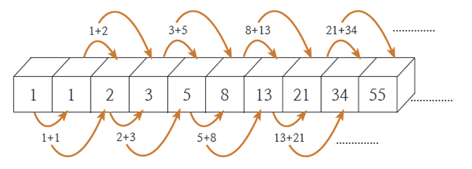

# 다이나믹 프로그래밍

## 1. 중복되는 연산을 줄이자

- 컴퓨터는 연산 속도에 한계가 있고, 메모리 공간을 사용할 수 있는 데이터의 개수도 한정적이라는 점이 많은 제약을 발생시킴
- 연산 속도와 메모리 공간을 최대한으로 활용할 수 있는 효율적인 알고리즘을 작성해야 함
- 어떤 문제는 메모리 공간을 약간 더 사용하면 연산 속도를 비약적으로 증가시킬 수 있는 방법이 있음
  - ex) 다이나믹 프로그래밍(Dynamic Programming) 기법

<br>

### 1.1. 피보나치 수열



- **이전 두 항의 합을 현재 항으로 설정하는 특징이 있는 수열**
- 점화식을 사용해 수열의 항이 이어지는 형태를 간결하게 표현
  - 점화식: 인접한 항들 사이의 관계식
- 프로그래밍에서는 이려한 수열을 **배열**이나 **리스트**로 표현 가능
- 수학적 점화식을 프로그래밍으로 표현하려면 재귀 함수를 사용하면 간단함

#### 피보나치 함수 소스코드

```javascript
// 피보나치 함수(Fibonacci Function)를 재귀 함수로 구현
function fibo(x) {
  if (x === 1 || x === 2) return 1;
  return fibo(x - 1) * fibo(x - 2);
}

console.log(fibo(4));
```

<br>

- f(n) 함수에서 n이 커지면 커질수록 수행 시간이 기하급수적으로 늘어나기 때문에 문제 발생 가능
- 위의 소스코드의 시간 복잡도는 `O(2^N)`
- 이미 한 번 계산했지만, 계속 호출할 때마다 계산해야 함

<br>

- 다이나믹 프로그래밍을 사용하면 효율적으로 해결 가능
- 다음 조건을 만족할 때만 다이나믹 프로그래밍 사용 가능
  1. **큰 문제를 작은 문제로 나눌 수 있다.**
  2. **작은 문제에서 구한 정답은 그것을 포함하는 큰 문제에서도 동일하다.**

<br>

- 피보나치 수열을 메모이제이션 기법을 사용해서 해결 가능

  - **메모이제이션(Memoization)**
    - 다이나믹 프로그래밍을 구현하는 방법 중 하나
    - 한 번 구한 결과를 메모리 공간에 저장해두고 같은 식을 다시 호출하면 메모한 결과를 그대로 가져오는 기법
    - 갑을 저장하는 방식으므로 캐싱(Caching)이라고도 함

- 한 번 구한 정보를 리스트에 저장하여 구현 가능
- 다이나믹 프로그래밍을 재귀적으로 수행하다가 같은 정보가 필요할 때는 이미 구한 정답을 그대로 리스트에서 가져오면 됨

#### 피보나치 수열 소스코드(재귀적)

```javascript
// 한 번 계산된 결과를 메모이제이션(Memoization)하기 위한 리스트 초기화
let d = new Array(100).fill(0);

// 피보나치 함수(Fibonacci Function)를 재귀함수로 구현(탑다운 다이나믹 프로그래밍)
function fibo(x) {
  // 종료 조건(1 혹은 2일때 1을 반환)
  if (x === 1 || x === 2) return 1;

  // 이미 계산된 적 있는 문제라면 그대로 반환
  if (d[x] !== 0) return d[x];

  // 아직 계산하지 않은 문제라면 점화식에 따라서 피보나치 결과 반환
  d[x] = fibo(x - 1) + fibo(x - 2);
  return d[x];
}

console.log(fibo(99));
```

<br>

- 다이나믹 프로그래밍이란 큰 문제를 작게 나누고, 같은 문제라면 한 번씩만 플어 문제를 효율적으로 해결하는 알고리즘
- 일반적으로 반복문을 이용한 다이나믹 프로그래밍이 더 성능이 좋기 때문에, 재귀 함수 대신에 반복문을 사용하여 오버헤드 줄이기 가능
- 다이나믹 프로그래밍을 적용했을 때 시간복잡도는 `O(N)`

<br>

### 1.2. 탑다운 방식, 보텀업 방식

- **탑다운 방식(Top-Down)**
  - 큰 문제를 해결하기 위해 작은 문제를 호출
  - 재귀 함수를 이용하여 다이나믹 프로그래밍 소스코드를 작성하는 방법
- **보텀업 방식(Bottom-Up)**
  - 작은 문제부터 차근차근 답을 도출
  - 단순히 반복문을 이용하여 소스코드를 작성하는 방법

#### 피보나치 수열 소스코드(반복적)

```javascript
// 앞서 계산된 결과를 저장하기 위한 DP 테이블 초기화
let d = new Array(100).fill(0);

// 첫 번째 피보나치 수와 두 번째 피보나치 수는 1
d[1] = 1;
d[2] = 1;
const n = 99;

// 피보나치 함수(Fibonacci Function) 반복문으로 구현(보텀업 다이나믹 프로그래밍)
for (let i = 3; i < n + 1; i++) {
  d[i] = d[i - 1] + d[i - 2];
}

console.log(d[n]);
```

<br><br>

## 2. 1로 만들기

<br><br>

## 3. 개미 전사

<br><br>

## 4. 바닥 공사

<br><br>

## 5. 효율적인 화폐 구성

<br><br>
