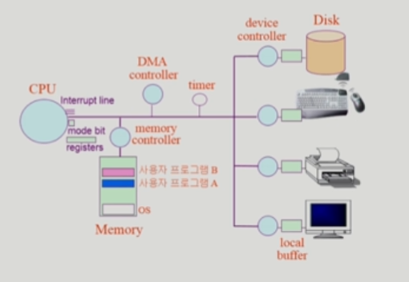

### 시스템 구조 (System Structure)

- Computer
  
  - CPU
    
    - 매 clock cycle마다 memory에서 instruction을 하나씩 가져와 실행
    
    - 매 실행이 끝나면 interrupt line을 확인
    
    - interrupt line
      
      - cpu는 항상 memory에 있는 instruction을 실행
      
      - I/O device에서의 입력이나 disk에서의 작업 완료 등을 전달
    
    - mode bit
      
      - cpu 안에 위치
      
      - cpu에서 실행되는 것이 운영체제인지 사용자 프로그램인지를 구분해줌
      
      - 0
        
        - 모니터모드, 커널모드, 시스템모드
          
          - OS 코드 수행
          
          - 메모리 접근, I/O device 접근 가능
        
        - interruption이나 exception 발생 시 하드웨어가 mode bit을 0으로 바꿈
      
      - 1
        
        - 사용자모드
          
          - 사용자 프로그램 수행
          
          - 제한된 instruction만 실행 가능
        
        - 사용자 프로그램에게 cpu를 넘기기 전에 mode bit을 1로 세팅
    
    - register
      
      - cpu 안에 위치
      
      - 정보를 저장하며 memory보다 빠르게 불러올 수 있음
  
  - memory
    
    - cpu의 작업공간
  
  - timer
    
    - computer에 존재하는 하드웨어
    
    - 특정 프로그램이 cpu를 독점하는 것을 막기 위함
    
    - memory에서 사용자 프로그램을 cpu에 넘겨줄 때 timer에 값을 세팅하여 넘겨주어 해당 시간이 지나면 cpu에 interrupt를 걸어줌
      
      - cpu가 interrupt를 확인하면 하던 일을 멈추고 cpu의 제어권이 사용자 프로그램에서 운영체제로 자동으로 넘어가게 됨
    
    - time sharing을 구현하기 위해 널리 이용됨
    
    - 현재 시간을 계산하기 위해서도 사용

- I/O device
  
  - disk
  
  - 키보드, 프린터, 모니터 등
  
  - 각각의 I/O device는 해당 device를 전담하는 작은 cpu인 device controller가 붙어있음
    
    - device controller
      
      - 해당 I/O 장치유형을 관리하는 일종의 작은 cpu
      
      - 제어 정보를 위해 control register, status register을 가짐
    
    - local buffer
      
      - device controller의 작업공간
  
  - 예를 들어 키보드 입력을 받는다고 했으면 키보드 입력이 끝난 후 해당 정보가 local buffer에 담기고 device controller가 cpu에 interrupt를 걺
    
    - cpu 제어권이 운영체제로 넘어가면서 local buffer의 값을 해당 정보를 요청한 프로그램의 메모리 공간에 copy한 후 기존에 cpu 제어권을 갖고 있던 프로그램에 제어권이 다시 넘어감