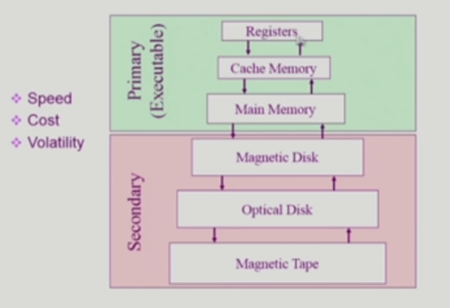
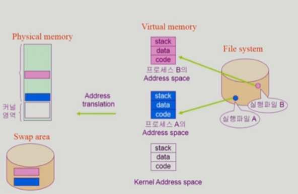

- 저장장치 계층 구조
  
  
  
  | CPU       | CPU           |
  | --------- | ------------- |
  | Primary   | Registers     |
  |           | Cache Memory  |
  |           | Main Memory   |
  | Secondary | Magnetic Disk |
  |           | Optical Disk  |
  |           | Magnetic Tape |
  
  - 특징
    
    - 위로 갈수록 속도가 빠른 매체 사용
    
    - 위로 갈수록 단위 공간 당 가격이 비싸기 때문에 용량이 적음
    
    - Primary는 휘발성, Secondary는 비휘발성
  
  - Primary
    
    - cpu에서 직접 접근 가능한 메모리 저장 매체
    
    - 바이트 단위로 접근 가능한 매체여야 함
  
  - Secondary
    
    - cpu에서 직접 처리하지 못하는 부분

- 프로그램의 실행 (메모리 load)
  
  
  
  - 하드디스크의 파일 시스템에 파일 형태로 저장되어있는 실행 파일을 실행
  
  - 가상 메모리에 해당 프로그램의 address space가 형성되고 각각은 code, data, stack으로 구성됨
  
  - 이후 필요한 부분은 주소 변환 후 물리메모리로 올라가서 프로세스가 되고 그렇지 않은 부분은 swap area에 위치

- 커널 주소 공간의 내용
  
  - code
    
    - 시스템콜, 인터럽트 처리 코드
    
    - 자원 관리를 위한 코드
    
    - 편리한 서비스 제공을 위한 코드
  
  - data
    
    - 운영체제가 사용하는 다양한 자료구조
  
  - stack
    
    - 사용자 프로그램마다 커널 스택을 따로 둠

- 사용자 프로그램이 사용하는 함수
  
  - 함수 (function)
    
    - 사용자 정의 함수
      
      - 자신의 프로그램에서 정의한 함수
    
    - 라이브러리 함수
      
      - 자신의 프로그램에서 정의하지 않고 갖다 쓴 함수
      
      - 자신의 프로그램의 실행 파일에 포함
    
    - 커널 함수
      
      - 운영체제 프로그램의 함수
      
      - 커널 함수의 호출 (시스템 콜)