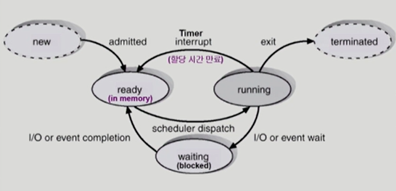

### 프로세스

- 개념
  
  - 실행중인 프로그램

- 문맥 (context)
  
  - cpu 수행 상태를 나타내는 하드웨어 문맥
    
    - program counter
    
    - 각종 register
  
  - 프로세스의 주소 공간
    
    - code, data, stack
  
  - 프로세스 관련 커널 자료 구조
    
    - PCB (Process Control Block)
    
    - Kernel stack

- 프로세스 상태 (Process State)
  
  
  
  - Running
    
    - cpu를 잡고 instruction을 수행중인 상태
  
  - Ready
    
    - cpu를 기다리는 상태 (메모리 등 다른 조건을 모두 만족하고)
  
  - Blocked (wait, sleep)
    
    - cpu를 주어도 당장 instruction을 수행할 수 없는 상태
    
    - process 자신이 요청한 이벤트 (I/O 등)가 즉시 만족되지 않아 이를 기다리는 상태
      
      - 디스크에서 파일을 읽어와야 하는 경우 등
  
  - New
    
    - 프로세스가 생성중인 상태
  
  - Terminated
    
    - 수행 (execution)이 끝난 상태
    
    - 끝나고 정리작업을 하는 상태
    
    - 완전히 끝나면 프로세스가 아니게 됨

- PCB (Process Control Block)
  
  - 운영체제가 각 프로세스를 관리하기 위해 프로세스당 유지하는 정보
  
  - 구성요소 - 구조체로 유지
    
    - OS가 관리상 사용하는 정보
      
      - Process State, Process ID
      
      - scheduling information, priority
    
    - CPU 수행 관련 하드웨어 값
      
      - Program counter, registers
    
    - 메모리 관련
      
      - code, data, stack의 위치 정보
    
    - 파일 관련
      
      - open file descriptors