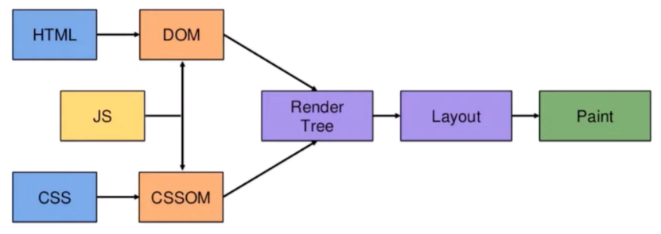

# 브라우저 렌더링 과정

```
✅ 우선, 브라우저 렌더링 엔진이 HTML 문서를 읽고 파싱하여 DOM(Document Object Model) 트리를 구축합니다.
동시에, CSS 파일과 스타일 정보를 읽고 파싱하여 CSSOM(Cascading Style Sheets Object Model) 트리를 구축합니다.
DOM 트리와 CSSOM 트리가 준비되면, 이 두 트리를 결합하여 렌더트리(Render Tree)를 생성합니다. 렌더트리는 실제로 화면에 렌더링될 요소들을 나타내며, 숨겨진 요소나 스타일이 적용되지 않는 요소는 제외됩니다.
각 렌더트리의 노드는 화면의 정확한 위치와 크기를 계산합니다. 이를 레이아웃이라고 합니다. 이 단계에서 브라우저는 각 요소가 화면에서 어디에 위치하고 어떤 크기를 가져야 하는지 계산합니다.
마지막으로, 계산된 위치와 크기에 따라 렌더트리의 각 노드가 화면에 그려집니다. 이러한 과정을 통해 사용자가 웹 페이지를 시각적으로 볼 수 있게 됩니다.
```

<br><br>



## 1. HTML parsing

- 브라우저 Rendering engine이 HTML을 parsing해서 DOM node로 이루어진 DOM Tree를 생성

<br>

## 2. CSS parsing

- CSS 파일과 Inline style을 parsing하여 CSSOM 생성

<br>

## 3. Render Tree 생성

- DOM Tree와 CSSOM을 결합해 Render Tree 생성
- **Render Tree**: 어떤 스타일이 적용되어야 하고, 순서는 어떻게 나타낼지 즉, 화면에 시각적으로 나타나는 요소들을 결정하게 됨
  - 반대로 시각적이지 않은 `<script>`, `display: 'none'` 등은 Render Tree에 그려지지 않음

<br>

## 4. Layout 단계

- 뷰포트 내에서 생성된 Render Tree의 각 노드들이 스크린 상의 어느 공간에 위치해야 할지 결정하고 position, size 등이 이 단계에서 계산됨
- **Layout**: 계산 범위에 따라서 Global Layout(전역적 레이아웃)과 Incremental Layout(증분적 레이아웃)을 볼 수 있는데, Global Layout은 전체 레이아웃을 계산하는 것을 말함
  - 폰트 적용, 폰트 사이즈 적용, offsetHeight 등과 같은 경우
- 노트가 많아지면 속도가 느리기에 브라우저에서 자체적인 최적화 로직을 탑재하고 있음
  - 그 중 하나가 Dirty bit system
  - 이를 활용하면 매번 처음부터 탐색하면서 레이아웃을 변경하지 않고, 특정 부분만 다시 계산함으로써 비용 줄이기 가능

<br>

## 5. Paint 단계

- 실제로 화면에 repaint가 되는 과정
