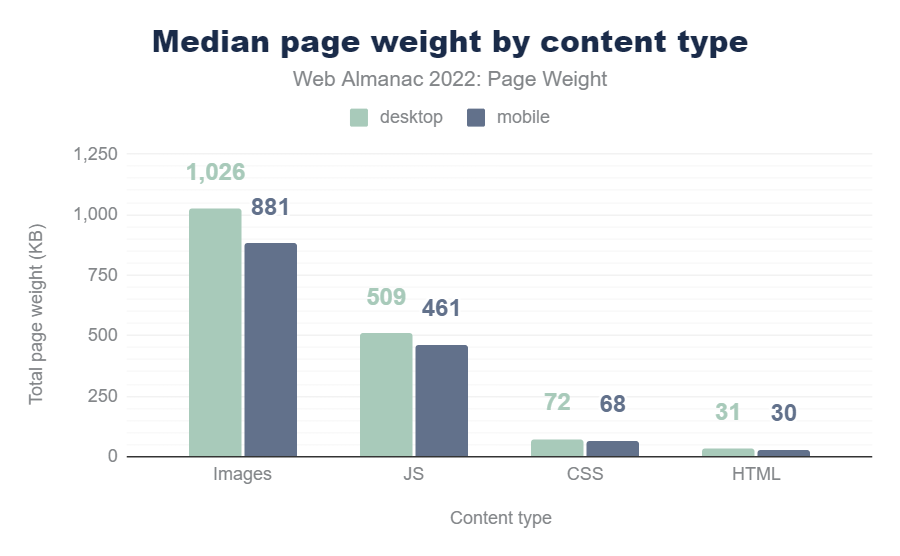

# 이미지 최적화와 압축 기법

## 이미지 최적화를 해야하는 이유?



- 이미지 파일은 웹 사이트에서 가장 많은 용량을 차지하는 콘텐츠
- 리소스 콘텐츠 유형의 용량의 중앙값을 확인했을 때, 이미지가 가장 큰 비중을 차지함

## 이미지 변환 기법: 무손실 압축과 손실 압축

1. 손실 압축 : 이미지 품질을 손상시키는 대신 파일 크기를 더욱 줄일 수 있는 방법
2. 무손실 압축 : 이미지 품질을 손상시키지 않고 파일 크기를 줄이는 방법

### 1. 이미지 손실 압축 (Lossy Compression):

- 원본 이미지의 일부 정보를 버림으로써 이미지의 크기를 줄임
- 이미지의 눈에 띄지 않거나 덜 중요한 부분에 대해 데이터를 제거함으로써 압축을 수행함
- 일반적으로 높은 압축률을 제공하지만, 원본 이미지와의 완전한 복원은 불가능함
- JPEG는 손실 압축 방식으로 널리 사용되는 이미지 포맷임
- JPEG 압축은 DCT (Discrete Cosine Transform) 기반의 알고리즘을 사용함
  - DCT (Discrete Cosine Transform) 기반 알고리즘 : 이미지를 주파수 도메인으로 변환하고, 고주파 영역의 정보를 삭제하여 이미지 크기를 줄임 (JPEG 압축률을 조절할 수 있어 원하는 품질과 파일 크기 간의 균형을 맞출 수 있음)
- 손실 압축 이미지 종류 : JPEG, JPEG 2000, WebP, AVIF 등

### 2. 무손실 압축 알고리즘 (Lossless Compression Algorithm)

- 원본 데이터를 정확하게 복원할 수 있는 방식으로 데이터 크기를 줄임
- 이미지 데이터의 패턴과 반복을 인식하고, 이를 효율적으로 표현하여 압축을 수행함
- PNG는 무손실 압축 이미지 포맷임
- PNG 압축은 DEFLATE 알고리즘을 사용하여 이미지 데이터를 압축함
  - DEFLATE : LZ77 및 허프만 코딩(Huffman coding)을 결합한 알고리즘 (LZ77은 이미지 데이터의 반복 패턴을 인식하고 허프만 코딩은 데이터의 빈도에 따라 코딩을 최적화 함)
- 무손실 압축 이미지 종류 : PNG, GIF, WebP 등

## 손실 기준을 어떻게 잡을 것인가?

- 손실 압축 이미지를 활용하여 로딩 속도를 개선하면 무조건 좋을까?
- 이미지 손실은 사용자 경험과 이어지기 때문에 손실을 아무런 기준없이 진행하면 위험함
- 사람은 명암 차이에는 민감한 반면, 채색 차이에는 크게 민감하지 않아 이미지 색이 비슷한 부분을 하나로 통일하여도 사용자 경험에 큰 차이가 없음
- https://github.com/rflynn/imgmin
- 75% 이하로 내려가는 순간 사용자가 시각적 반응에 민감해진다는 연구 결과

## 화면 크기에 맞는 적절한 이미지를 보여주기

- 다양한 디바이스로 인해 화면 크기가 다양하기 때문에 각 상황에 맞는 적절한 이미지를 브라우저에 로딩하는 것이 중요함
- 모바일 화면에서 4K 화면에서 사용될 이미지를 다운로드 받는 것은 비효율적이기 때문

### srcset, size 속성

- srcset은 브라우저에게 제시할 이미지 목록과 그 크기를 정의함
- sizes은 미디어 쿼리를 통해 w를 사용한 srcset 속성이 제공하는 랜더링할 후보 이미지들을 어떻게 사용할지에 대한 규칙을 정의
- HTML의 `` 태그에 사용되며, 브라우저에게 여러 이미지 소스를 제공하고 이미지를 다양한 해상도에서 표시할 수 있게 함
- 이를 통해 반응형 웹 디자인에서 디스플레이 크기나 픽셀 밀도에 따라 가장 적절한 이미지를 선택하고 로드할 수 있음

```html

```

- src 속성은 기본 이미지를 설정하고, srcset 속성에는 각 이미지 파일과 그에 해당하는 이미지의 너비(해상도)를 지정함
- w 단위는 너비를 의미하며, 이미지 너비를 픽셀로 나타냄
- 위 예시에서 브라우저는 기기의 화면 크기와 픽셀 밀도를 고려하여 사용 가능한 이미지 중 가장 적합한 이미지를 선택함
- (max-width: 700px) 700px: 뷰포트의 너비가 700px 이하일 때 srcset 속성에서 설정한 700w 값과 가장 근사치의 랜더링할 이미지 후보가 랜더링됩니다. 여기에서는 medium.jpg가 랜더링
- srcset 속성을 사용하면 다양한 환경에서 이미지를 최적화하고 사용자에게 더 나은 사용자 경험을 제공할 수 있음

### picture 태그

- `<picture>` 태그는 웹 페이지에서 다양한 조건에 따라 이미지 소스를 선택하고 사용할 수 있도록 도와주는 HTML5의 요소
- `<picture>` 태그는 여러 `<source>` 태그를 포함하며 이를 통해 미디어 쿼리와 함께 다양한 이미지 소스를 제공할 수 있음
- 브라우저는 `<source>` 태그들 중 조건에 맞는 이미지를 선택하여 로드하게 됨
- `<picture>` 태그와 srcset 속성을 함께 사용하면 뷰포트 크기에 따라 더욱 정교한 이미지 선택이 가능함

```html
<picture>
  <source media="(min-width: 1280px)" srcset="large.jpg" />
  <source media="(min-width: 720px)" srcset="medium.jpg" />
  
</picture>
```

- 위 예시에서는 뷰포트의 너비가 1280 픽셀 이상인 경우 large.jpg 이미지를 사용하고, 720 픽셀 이상인 경우 medium.jpg 이미지를 사용함 그 외의 경우에는 기본 이미지인 small.jpg를 사용함
- `<picture>` 태그와 srcset 속성을 함께 사용하면, 화면 크기, 픽셀 밀도, 이미지 형식 등 다양한 조건에 따라 최적화된 이미지를 제공할 수 있으며, 이를 통해 사용자에게 더 나은 사용자 경험을 제공할 수 있음

## 실제 활용 사례

- https://about.daangn.com/
