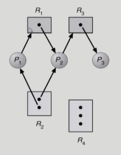
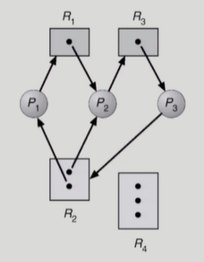
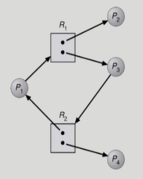

### Deadlock (교착상태)

- deadlock
  
  - 일련의 프로세스들이 서로가 가진 자원을 기다리며 block된 상태
  
  - resource (자원)
    
    - 하드웨어, 소프트웨어 등을 포함하는 개념
    
    - I/O device, CPU cycle, memory space, semaphore 등
    
    - 프로세스가 자원을 사용하는 절차
      
      - request, allocate, use, release

- deadlock 발생의 4가지 조건
  
  - mutual exclusion (상호배제)
    
    - 매 순간 하나의 프로세스만이 자원을 사용할 수 있음
  
  - no preemption (비선점)
    
    - 프로세스는 자원을 스스로 내어놓을 뿐 강제로 빼앗기지 않음
  
  - hold and wait (보유대기)
    
    - 자원을 가진 프로세스가 다른 자원을 기다릴 때 보유 자원을 놓지 않고 계속 가지고 있음
  
  - circular wait (순환대기)
    
    - 자원을 기다리는 프로세스 간 사이클이 형성되어야 함

- resource-allocation graph (자원할당그래프)
  
  - deadlock이 발생했는지 확인하기 위한 그래프
    
    - deadlock 확인 여부
      
      - 그래프에 cycle이 없으면 deadlock 아님
      
      - 그래프에 cycle이 있으면
        
        - if only one instance per resource type, then deadlock
        
        - if several instances per resource type, possibility of deadlock
    
    - 예시
      
      
      
      - P1 (프로세스)
        
        - 2번 자원을 가지고 있으면서 1번 자원을 기다리고 있음
        
        - 1번 자원 (R1)은 P2가 가지고 있음
          
          - P2는 1번 자원, 2번 자원을 가지고 있으면서 3번 자원을 기다리고 있음
            
            - 3번 자원은 P3가 가지고 있음
            
            - cycle이 없으므로 deadlock 아님
      
      
      
      - R2의 인스턴스가 2개이지만 더 이상 진행이 불가능
        
        - deadlock
      
      
    
    - 각 자원의 인스턴스를 모두 사용하고 cycle이 있지만 프로세스 2와 프로세스 4가 자원을 반납하면 해결