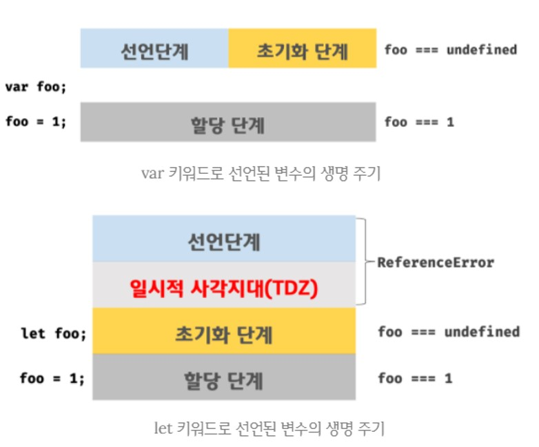

# var vs. let vs. const

```
var와 let, const는 변수를 선언하는 데 사용되는 키워드로, 각각 다른 특징을 가지고 있습니다.

우선, var는 중복 선언을 허용하며, 이로 인해 의도치 않게 먼저 선언된 변수 값이 변경되는 부작용이 발생할 수 있습니다.
또한 var는 함수 레벨 스코프를 가지고 있어 전역 변수를 남발할 가능성이 있습니다.

ES6에서는 let과 const가 도입되어 var의 이러한 단점을 보완하고 있습니다.
let과 const는 변수의 중복 선언을 금지하며, 블록 레벨 스코프를 가지고 있어 블록 내에서 선언된 변수는 블록 외부에서 접근할 수 없습니다.

let은 재할당이 가능한 변수를 선언할 때 사용하며, 변수의 값을 변경할 수 있습니다.
반면에 const는 상수를 선언하는 데 사용되며, 한 번 할당된 값은 변경할 수 없습니다.
이로써 cosnt를 사용하면 의도치 않은 재할당을 방지하고 안정성을 높일 수 있습니다.

따라서, 코드의 가독성과 유지보수성을 높이기 위해서는 가능한 var보다는 let 또는 const를 사용하는 것이 권장됩니다.
```

<br><br>

## 1. `var` 키워드로 선언한 변수의 문제점

### 1.1. 변수 중복 선언 허용

- **`var` 키워드로 선언한 변수는 중복 선언이 가능함**

  ```jsx
  var x = 1;
  var y = 1;

  // var 키워드로 선언도니 변수는 같은 스코프 내에서 중복 선언을 허용함
  // 초기화문(변수 선언과 동시에 초기값을 할당하는 문)이 있는 변수 선언문은 자바스크립트 엔진에 의해 var 키워드가 없는 것처럼 동작
  var x = 100;
  // 초기화문이 없는 변수 선언문은 무시됨
  var y;

  console.log(x); // 100
  console.log(y); // 1
  ```

- 동일한 이름의 변수가 이미 선언되어 있는 것을 모르고 변수를 중복 선언하면서 값까지 할당했다면 의도치 않게 먼저 선언된 변수 값이 변경되는 부작용 발생

<br>

### 1.2. 함수 레벨 스코프

- `var` 키워드로 선언한 변수는 **오로지 함수의 코드 블록만을 지역 스코프로 인정**함

  - 함수 외부에서 `var` 키워드로 선언한 변수는 코드 블록 내에서 선언해도 모두 전역 변수가 됨

  ```jsx
  var x = 1;

  if (true) {
    // x는 전역 변수다. 이미 선언된 전역 변수 x가 있으므로 x 변수는 중복 선언된다.
    // 이는 의도치 않게 변수값이 변경되는 부작용을 발생시킨다.
    var x = 10;
  }

  console.log(x); // 10
  ```

  ```jsx
  var i = 10;

  // for문에서 선언한 i는 전역 변수다. 이미 선언된 전역 변수 i가 있으므로 중복 선언된다.
  for (var i = 0; i < 5; i++) {
    console.log(i); // 0 1 2 3 4
  }

  // 의도치 않게 i 변수의 값이 변경되었다.
  console.log(i); // 5
  ```

- 함수 레벨 스코프는 전역 변수를 남발할 가능성을 높임
  - 의도치 않게 전역 변수가 중복 선언되는 경우가 발생

<br>

### 1.3. 변수 호이스팅

- 변수 호이스팅에 의해 변수 선언문이 스코프의 선두로 끌어 올려진 것처럼 동작함

  - 변수 선언문 이전에 참조 가능
  - 할당문 이전에 변수를 참조하면 언제나 `undefined` 반환

  ```jsx
  // 이 시점에는 변수 호이스팅에 의해 이미 foo 변수가 선언되었다(1. 선언 단계)
  // 변수 foo는 undefined로 초기화된다(2. 초기화 단계)
  console.log(foo); // undefined

  // 변수에 값을 할당(3. 할당 단계)
  foo = 123;

  console.log(foo); // 123

  // 변수 선언은 런타임 이전에 자바스크립트 엔진에 의해 암묵적으로 실행됨
  var foo;
  ```

- 변수 선언문 이전에 변수를 참조하는 것은 변수 호이스팅에 의해 에러를 발생시키지는 않지만 **프로그램의 흐름상 맞지 않을뿐더러 가독성을 떨어뜨리고 오류를 발생시킬 여지를 남김**

<br><br>

## 2. `let` 키워드

- `var` 키워드의 단점을 보완하기 위해 ES6에서 새로운 변수 선언 키워드인 `let`과 `const`를 도입

<br>

### 2.1. 변수 중복 선언 금지

- 이름이 같은 변수를 중복 선언하면 **문법 에러(SyntaxError)** 가 발생

  ```jsx
  var foo = 123;
  // var 키워드로 선언된 변수는 같은 스코프 내에서 중복 선언을 허용한다.
  // 아래 변수 선언문은 자바스크립트 엔진에 의해 var 키워드가 없는 것처럼 동작한다.
  var foo = 456;

  let bar = 123;
  // let이나 const 키워드로 선언된 변수는 같은 스코프 내에서 중복 선언을 허용하지 않는다.
  let bar = 456; // SyntaxError: Identifier 'bar' has already benn declared
  ```

<br>

### 2.2. 블록 레벨 스코프(block-level scope)

- `let` 키워드로 선언된 변수는 블록 레벨 스코프를 따름

  - 모든 코드 블록(함수, `if` 문, `for` 문, `while` 문, `try/catch` 문 등)을 지역 스코프로 인정

  ```jsx
  let foo = 1; // 전역 변수

  {
    let foo = 2; // 지역 변수
    let bar = 3; // 지역 변수
  }

  console.log(foo); // 1
  console.log(bar); // ReferenceError: bar is not defined
  ```

<br>

### 2.3. 변수 호이스팅

- `let` 키워드로 선언한 변수는 **변수 호이스팅이 발생하지 않는 것처럼 동작**
  - `let` 키워드로 선언한 변수를 변수 선언문 이전에 참조하면 참조 에러(ReferenceError) 발생
- **`let` 키워드로 선언한 변수는 “선언 단계”와 초기화 단계”가 분리되어 진행됨**

  - 런타임 이전에 자바스크립트 엔진에 의해 암묵적으로 선언 단계가 먼저 실행되지만 초기화 단계는 변수 선언문에 도달했을 때 실행됨
  - 초기화 단계가 실행되기 이전에 변수에 접근하려고 하면 참조 에러(Reference Error) 발생
  - `let` 키워드로 선언한 변수는 스코프의 시작 지점부터 초기화 단계 시작 지점(변수 선언문)까지 변수를 참조할 수 없음
  - **일시적 사각지대(Temporal Dead Zone; TDD)**: 스코프의 시작 지점부터 초기화 시작 지점까지 변수를 참조할 수 없는 구간

    ```jsx
    // 런타임 이전에 선언 단계가 실행됨. 아직 변수가 초기화되지 않음
    // 초기화 이전의 TDD에서는 변수 참조할 수 없음
    console.log(foo); // ReferenceError: foo is not defined

    let foo; // 변수 선언문에서 초기화 단계가 실행됨
    console.log(f00); // undefined

    foo = 1; // 할당문에서 할당 단계가 실행됨
    console.log(foo); // 1
    ```

    

- 자바스크립트는 ES6에서 도입된 `let`, `const`를 포함해서 모든 선언(`var`, `let`, `const`, `function`, `function*`, `class` 등)을 호이스팅함

  - `let`, `const`, `class`를 사용한 선언문은 호이스팅이 발생하지 않는 것처럼 동작
  - 예시 코드

    ```jsx
    let foo = 1; // 전역 변수

    {
      console.log(foo); // ReferenceError: Cannot access 'foo' before initialization
      let foo = 2; // 지역 변수
    }
    ```

    - `let` 키워드로 선언한 변수의 경우 변수 호이스팅이 발생하지 않는다면 위 예제는 전역 변수 `foo`의 값을 출력해야함
    - `let` 키워드로 선언한 변수도 여전히 호이스팅이 발생하기 때문에 참조 에러 발생

<br>

### 2.4. 전역 객체와 `let`

- `let` 키워드로 선언한 전역 변수는 전역 객체의 프로퍼티가 아님
  - `window.foo`와 같이 접근할 수 없음
- `let` 젼역 변수는 보이지 않는 개념적인 블록(전역 렉시컬 환경의 선언적 환경 레코드) 내에 존재하게 됨

  ```jsx
  // 이 예제는 브라우저 환경에서 실행해야 함
  let x = 1;

  // let, const 키워드로 선언한 전역 변수는 전역 객체 window의 프로퍼티가 아님
  console.log(window.x); // undefined
  console.log(x); // 1
  ```

<br><br>

## 3. `const` 키워드

### 3.1. 선언과 초기화

- **`const` 키워드로 선언한 변수는 반드시 선언과 동시에 초기화해야 함**
  ```jsx
  const foo = 1;
  ```
  ```jsx
  const foo; // SyntaxError: Missing initializer in const declaration
  ```
- `const` 키워드로 선언한 변수는 `let` 키워드로 선언한 변수와 마찬가지로 **블록 레벨 스코프**를 가지며, **변수 호이스팅이 발생하지 않는 것처럼 동작**함

  ```jsx
  {
    // 변수 호이스팅이 발생하지 않는 것처럼 동작
    console.log(foo); // ReferenceError: Cannot access 'foo' before initialization
    const foo = 1;
    console.log(foo); // 1
  }

  // 블록 레벨 스코프를 가짐
  console.log(foo); // ReferenceError: foo is not defined
  ```

<br>

### 3.2. 재할당 금지

- `var` 또는 `let` 키워드로 선언한 변수는 재할당이 자유로우나 **`const` 키워드로 선언한 변수는 재할당이 금지됨**
  - 예시 코드
    ```jsx
    const foo = 1;
    foo = 2; // ReferenceError: Assignment to constant variable.
    ```

<br>

### 3.3. 상수(constant)

- `const` 키워드로 선언한 변수에 원시 값을 할당한 경우 변수 값을 변경할 수 없음
  - 원시 값은 변경 불가능한 값(immutable value)이므로 재할당 없이 값을 변경할 수 있는 방법이 없기 때문
  - 이를 이용하여 `const` 키워드를 상수를 표현하는 데 사용
- **상수는 재할당이 금지된 변수**를 말함
  - 상수도 값을 저장하기 위한 메모리 공간이 필요하므로 변수라고 할 수 있음
  - 변수는 언제든지 재할당을 통해 변수 값을 변경할 수 있지만 상수는 재할당이 금지됨
- 상수는 상태 유지와 가독성, 유지보수의 편의를 위해 적극적으로 사용해야 함

  ```jsx
  // 세율을 의미하는 0.1은 변경할 수 없는 상수로서 사용될 값
  // 변수 이름을 대문자로 선언해 상수임을 명확히 나타냄
  const TAX_RATE = 0.1;

  // 세전 가격
  let preTaxPrice = 100;

  // 세후 가격
  let afterTaxPrice = preTaxPrice + preTaxPrice * TAX_RATE;

  console.log(afterTaxPrice); // 110
  ```

<br>

### 3.4. `const` 키워드와 객체

- **`const` 키워드로 선언된 변수에 객체를 할당할 경우 값 변경 가능**

  - 변경 불가능한 값인 원시 값은 재할당 없이 변경(교체)할 수 있는 방법이 없지만 변경 가능한 값인 객체는 재할당 없이도 직접 변경이 가능하기 때문

    ```jsx
    const person = {
      name: "Lee",
    };

    // 객체는 변경 가능한 값임. 따라서 재할당 없이 변경 가능
    person.name = "Kim";

    console.log(person); // {name: "Kim"}
    ```

- **`const` 키워드는 재할당을 금지할 뿐 “불변”을 의미하지 않음**
  - 새로운 값을 재할당하는 것을 불가능하지만 프로퍼티 동적 생성, 삭제, 프로퍼티 값의 변경을 통해 객체를 변경하는 것을 가능
  - 객체가 변경되더라도 변수에 할당된 참조 값은 변경되지 않음

<br><br>

## 4. `var` vs. `let` vs. `const`

- ES6를 사용한다면 `var` 키워드는 사용하지 않음
- 재할당이 필요한 경우에 한정해 `let` 키워드를 사용함
  - 변수의 스코프는 최대한 좁게 만들기
- 변경이 발생하지 않고 읽기 전용으로 사용하는(재할당이 필요 없는 상수) 원시 값과 객체에는 `const` 키워드 사용
  - `const` 키워드는 재할당을 금지하므로 `var`, `let` 키워드보다 안전함
