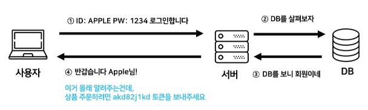
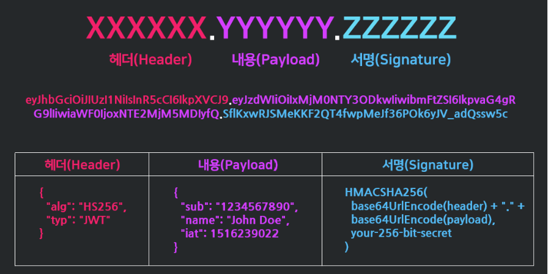
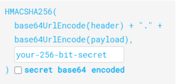
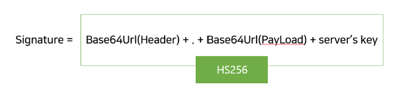
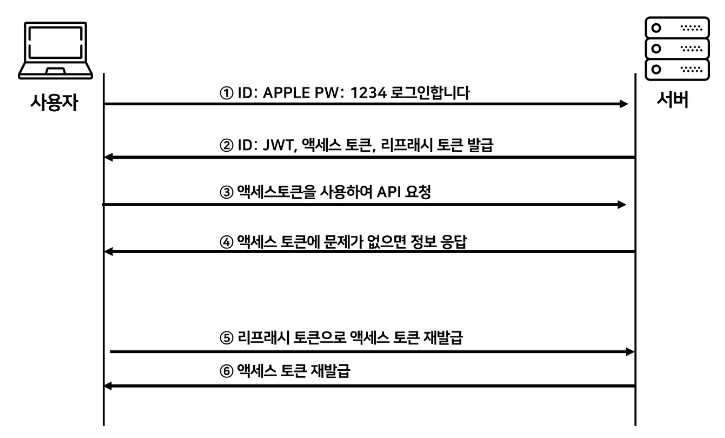

# JWT를 이용한 인증 과정

```
1. 로그인:
    - 사용자가 아이디와 비밀번호로 로그인을 시도합니다.
2. 토큰 발급:
    - 서버는 유효한 로그인 정보를 받으면, 해당 사용자를 위한 고유한 JWT를 생성합니다.
    - 이 JWT에는 사용자의 식별 정보 및 권한과 같은 클레임(claims)이 포함됩니다.
3. JWT 전달:
    - 서버는 생성된 JWT를 클라이언트에게 안전한 방식(예: HttpOnly 및 Secure 속성이 설정된 쿠키)으로 전달합니다.
    - 클라이언트는 이 JWT를 안전한 저장소(로컬 스토리지 또는 쿠키)에 저장합니다.
4. 인증 요청:
    - 사용자가 보호된 자원에 접근하려면, 클라이언트는 HTTP 요청 헤더의 Authorization 필드에 저장된 JWT를 담아서 서버에 요청을 보냅니다.
5. JWT 검증:
    - 서버는 클라이언트로부터 받은 JWT의 유효성을 확인합니다.
    - 이때, 서버는 JWT의 서명을 검증하고 클레임의 내용을 확인하여 사용자를 인증합니다.
6. 인증 및 자원 제공:
    - JWT가 유효하면, 서버는 해당 사용자의 권한을 확인하고 요청된 자원에 접근을 허용합니다.
    - 인증이 성공하면, 서버는 클라이언트에게 필요한 자원을 제공합니다.
7. 토큰 갱신 (선택적):
    - 만약 토큰이 만료되면, 클라이언트는 리프래시 토큰을 사용하여 새로운 액세스 토큰을 요청할 수 있습니다.

이 과정을 통해 JWT는 클라이언트와 서버 간에 안전하게 사용자를 인증하고, 권한 부여를 통해 자원에 접근할 수 있는 기능을 제공합니다.
```

<br>

## 1. JWT(JSON Web Token)이란?



- JWT: **인증이 필요한 정보들을 암호화시킨 JSON 토큰**
- JWT 기반 인증: JWT 토큰(Access Token)을 HTTP 헤더에 실어 서버가 클라이언트를 식별하는 방식
- JWT
  - JSON 데이터를 **Base64 URL-safe Encode**를 통해 인코딩하여 직렬화한 것
  - 토큰 내부에 위변조 방지를 위해 개인키를 통한 **전자서명**도 들어있음
- 사용자가 JWT를 서버로 전송하면 서버는 서명을 검증하는 과정을 거치게 되며 완료되면 요청한 응답을 돌려줌

<br><br>

## 2. JWT 구조



- JWT는 `.`를 구분자로 나누어지는 세 가지 문자열의 조합
- `.`을 기준으로 좌측부터 **Header**, **Payload**, **Signature**를 의미함
  - Header → JWT에서 사용할 타입과 해시 알고리즘의 종류가 담겨 있음
  - Payload → 서버에서 첨부한 사용자 권한 정보와 데이터가 담겨 있음
  - Signature → Header, Payload를 Base64 URL-safe Encode를 한 이후 Header에 명시된 해시함수를 적용하고, 개인키(Private Key)로 서명한 전자서명이 담겨 있음

<br>

### 2.1. Header

```json
{
  "alg": "HS256",
  "typ": "JWT"
}
```

- `alg`: 서명 암호화 알고리즘(ex: HMAC SHA256, RSA)
- `typ`: 토큰 유형

<br>

### 2.2. Payload

- 토큰에서 사용할 정보의 조각들인 Claim이 담겨 있음 (실제 JWT를 통해서 알 수 있는 데이터)
- 서버와 클라이언트가 주고받는 시스템에서 실제로 **사용될 정보에 대한 내용**을 담고 있는 섹션

```json
{
  "sub": "1234567890",
  "name": "John Doe",
  "iat": 1516239022
}
```

- Payload는 정해진 데이터 타입은 없지만, 대표적으로 **Registered claims**, **Public claims**, **Private claims** 세 가지로 나뉨
  ```json
  {
    "jti": "1000", // Registered Claim
    "exp": "1521430000000", // Registered Claim
    "https://kevin.tistory.com": true, // Public Claim
    "username": "keven" // Private Claim
  }
  ```
  - Registered claims
    - 미리 정의된 클레임
      - `iss` (issuer; 발행자)
      - `exp` (expireation time; 만료 시간)
      - `sub` (subject; 제목)
      - `iat` (issued At; 발행 시간)
      - `jti` (JWI ID)
  - Public claims
    - 사용자가 정의할 수 있는 클레임 공개용 정보 전달을 위해 사용
  - Private claims
    - 해당하는 당사자들 간에 정보를 공유하기 위해 만들어진 사용자 지정 클레임
    - 외부에 공개되어도 상관없지만 해당 유저를 특정할 수 있는 정보들을 담음

<br>

### 2.3. Signature



- 시그니처에서 사용하는 알고리즘은 헤더에서 정의한 알고리즘 방식(`alg`)을 활용함
- 시그니처의 구조는 **(헤더 + 페이로드)**와 서버가 갖고 있는 **유일한 key 값**을 합친 것을 헤더에서 정의한 알고리즘으로 암호화
  
- Signature는 토큰의 위변조 여부를 확인하는 데 사용됨
  - Header와 Payload는 단순히 인코딩된 값이기 때문에 제 3자가 복호화 및 조작할 수 있지만, Signature는 서버 측에서 관리하는 비밀키가 유출되지 않는 이상 복호화할 수 없음

<br><br>

## 3. JWT를 이용한 인증 과정



1. 사용자가 ID, PW를 입력하여 서버에 로그인 인증을 요청함
2. 서버에서 클라이언트로부터 인증 요청을 받으면, Header, Payload, Signature를 정의함
   - Header, Payload, Signature를 각각 Base64로 인코딩하여 JWT를 생성하고 이를 쿠키에 담아 클라이언트에게 발급
3. 클라이언트는 서버로부터 받은 JWT를 안전한 방식으로 저장 (ex: HttpOnly 및 Secure 속성이 설정된 쿠키를 사용)
   - API를 서버에 요청할 때 **Authorization header**에 **Access Token**을 담아서 보냄
4. 서버가 할 일은 클라이언트가 Header에 담아서 보낸 JWT가 내 서버에서 발행한 토큰인지 일치 여부를 확인하여 일치한다면 인증을 통과시켜주고 아니라면 통과시키지 않음
   - 인증이 통과되었으므로 Payload에 들어있는 유저의 정보들을 select해서 클라이언트에 돌려줌
5. 클라이언트가 서버에 요청을 했는데, 만일 액세스 토큰의 시간이 만료되면 클라이언트는 리프래시 토큰을 사용하여 서버로 새로운 액세스 토큰을 요청하고
6. 서버로부터 새로운 엑세스 토큰을 발급 받음

<br><br>

## 4. JWT 장단점

|                  | 장점                                   | 단점 |
| ---------------- | -------------------------------------- | ---- |
| Cookie & Session | - Cookie만 사용하는 방식보다 보안 향상 | - 서버 쪽에서 Session 통제 가능 <br>- 네트워크 부하 낮음 | - 세션 저장소 사용으로 인한 서버 부하 |
  | JWT | - 인증을 위한 별도의 저장소가 필요 없음 <br> - 별도의 I/O 작업 없는 빠른 인증 처리 <br> - 확장성이 우수함 | - 토큰의 길이가 늘어날수록 네트워크 부하 <br> - 특정 토큰을 강제로 만료시키기 어려움 |

<br>

### 4.1. JWT 장점

- Header와 Payload를 가지고 Signature를 생성하므로 **데이터 위변조를 막을 수 있음**
- 인증 정보에 대한 **별도의 저장소가 필요 없음**
- JWT는 토큰에 대한 기본 정보와 전달할 정보 및 토큰이 검증됐음을 증명하는 서명 등 필요한 모든 정보를 자체적으로 지니고 있음
- 클라이언트 인증 정보를 저장하는 세션과 다르게, **서버는 무상태(Stateless)** 가 되어 서버 확장성이 우수해질 수 있음
- 토큰 기반으로 **다른 로그인 시스템에 접근 및 권한 공유가 가능(쿠키와 차이**)
- OAuth의 경우 Facebook, Google 등 소셜 계정을 이용하여 다른 웹 서비스에서도 로그인 가능
- 모바일 애플리케이션 환경에서도 잘 동작함 (모바일은 세션 사용 불가능)

<br>

### 4.2. JWT 단점

- Self-contained
  - 토큰 자체에 정보를 담고 있으므로 양날의 검이 될 수 있음
- 토큰 길이
  - 토큰의 Payload에 3종류의 클레임을 저장하기 때문에, 정보가 많아질수록 토큰의 길이가 늘어나 네트워크 부하를 줄 수 있음
- Payload 인코딩
  - Payload 자체는 암호화된 것이 아니라 BASE64로 인코딩된 것이기 때문에, 중간에 Payload를 탈취하여 디코딩하면 데이터를 볼 수 있으므로, Payload에 중요 데이터를 넣지 않아야 함
- Store Token
  - stateless 특징을 가지기 때문에, 토큰은 클라이언트 측에서 관리하고 저장함
  - 토큰 자체를 탈취당하면 대처하기 어렵게 됨

<br><br>

## 5. JWT의 Access Token / Refresh Token

- JWT도 제 3자에게 토큰 탈취의 위험성이 있기 때문에, 그대로 사용하는 것이 아닌 **Access Token**, **Refresh Token**으로 이중으로 나누어 인증을 하는 방식을 협업에서 취함
- Access Token과 Refresh Token은 둘다 똑같은 JWT이지만, 토큰이 어디에 저장되고 관리되느냐에 따른 사용 차이가 있음
- Access Token
  - **클라이언트**가 갖고 있는 실제로 유저의 정보가 담긴 토큰
  - 클라이언트에서 요청이 오면 서버에서 해당 토큰에 있는 정보를 활용하여 사용자 정보에 맞게 응답을 진행
- Refresh Token
  - 새로운 Access Token을 발급해주기 위해 사용하는 토큰
  - 짧은 수명을 가지는 Access Token에게 새로운 토큰을 발급해주기 위해 사용
  - 해당 토큰은 보통 **데이터베이스**에 유저 정보와 같이 기록

→ **Access Token은 접근에 관여하는 토큰, Refresh Token은 재발급에 관여하는 토큰의 역할로 사용되는 JWT**
