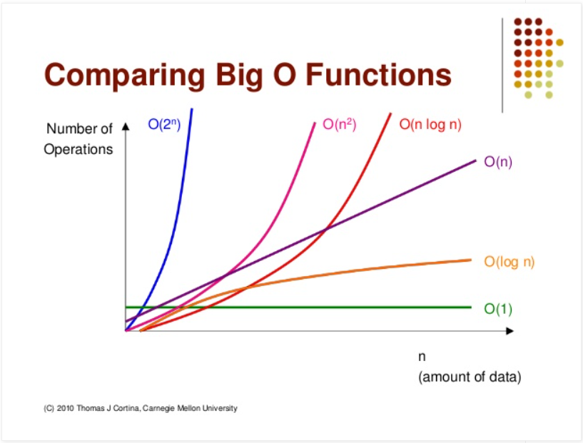

### 자료구조

- 자료구조 (data structure)
  
  - 효율적으로 데이터를 관리하고 수정, 삭제, 탐색, 저장할 수 있는 데이터 집합

### 복잡도

- 시간 복잡도
  
  - 문제를 해결하는 데 걸리는 시간과 입력의 함수 관계
  
  - 어떠한 알고리즘의 로직이 얼마나 오랜 시간 걸리는지 나타냄
  
  - 빅오 표기법
    
    - 입력 범위 n을 기준으로 로직이 몇 번 반복되는지 나태내는 것
    
    - O(n), O(n^2)과 같이 표기
      
      | Big Oh   | 시간                         |
      |:--------:|:--------------------------:|
      | O(1)     | 상수 시간 (Constant time)      |
      | O(logn)  | 로그 시간 (Logarithmic time)   |
      | O(n)     | 선형 시간 (Linear time)        |
      | O(nlogn) | 로그 선형 시간 (Log-linear time) |
      | O(n^2)   | 제곱 시간 (Quadratic time)     |
      | O(n^3)   | 세제곱 시간 (Cubic time)        |
      | O(2^n)   | 지수 시간 (Exponential time)   |
  
  - 시간 복잡도의 존재 이유
    
    - 효율적인 코드로 개선하는 데 쓰이는 척도
  
  - 시간 복잡도의 속도 비교
    
    

- 공간 복잡도
  
  - 프로그램을 실행시켰을 때 필요로 하는 자원 공간의 양
  
  - 정적 변수로 선언된 것 말고도 동적으로 재귀적인 함수로 인해 공간을 계속해서 필요로 할 경우도 포함

- 자료 구조에서의 시간 복잡도
  
  - 평균 시간 복잡도
    
    | 자료 구조                          | 접근      | 탐색      | 삽입      | 삭제      |
    |:------------------------------:|:-------:|:-------:|:-------:|:-------:|
    | 배열 (array)                     | O(1)    | O(n)    | O(n)    | O(n)    |
    | 스택 (stack)                     | O(n)    | O(n)    | O(1)    | O(1)    |
    | 큐 (queue)                      | O(n)    | O(n)    | O(1)    | O(1)    |
    | 이중 연결 리스트 (doubly linked list) | O(n)    | O(n)    | O(1)    | O(1)    |
    | 해시 테이블 (hash table)            | O(1)    | O(1)    | O(1)    | O(1)    |
    | 이진 탐색 트리 (BST)                 | O(logn) | O(logn) | O(logn) | O(logn) |
    | AVL 트리                         | O(logn) | O(logn) | O(logn) | O(logn) |
    | 레드 블랙 트리                       | O(logn) | O(logn) | O(logn) | O(logn) |
  
  - 최악의 시간 복잡도
    
    | 자료 구조                          | 접근      | 탐색      | 삽입      | 삭제      |
    |:------------------------------:|:-------:|:-------:|:-------:|:-------:|
    | 배열 (array)                     | O(1)    | O(n)    | O(n)    | O(n)    |
    | 스택 (stack)                     | O(n)    | O(n)    | O(1)    | O(1)    |
    | 큐 (queue)                      | O(n)    | O(n)    | O(1)    | O(1)    |
    | 이중 연결 리스트 (doubly linked list) | O(n)    | O(n)    | O(1)    | O(1)    |
    | 해시 테이블 (hash table)            | O(n)    | O(n)    | O(n)    | O(n)    |
    | 이진 탐색 트리 (BST)                 | O(n)    | O(n)    | O(n)    | O(n)    |
    | AVL 트리                         | O(logn) | O(logn) | O(logn) | O(logn) |
    | 레드 블랙 트리                       | O(logn) | O(logn) | O(logn) | O(logn) |