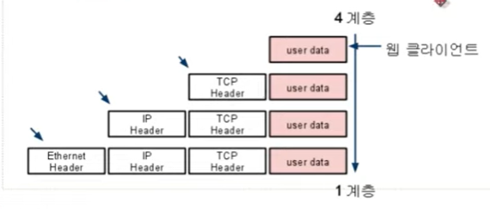
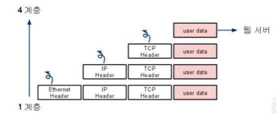

### 계층 간 데이터 송수신 과정

1. 애플리케이션 계층에서 전송 계층으로 송신하는 요청 값들이 캡슐화 과정을 거쳐 전달됨

2. 링크 계층을 통해 해당 서버와 통신

3. 해당 서버의 링크 계층으로부터 애플리케이션까지 비캡슐화 과정을 거쳐 데이터 전송
- 캡슐화 과정
  
  - 상위 계층의 헤더와 데이터를 하위 계층의 데이터 부분에 포함시키고 해당 계층의 헤더를 삽입하는 과정
    
    
    
    1. 애플리케이션 계층 -> 전송 계층
       
       - TCP(L4) 헤더가 붙으면서 세그먼트화 혹은 데이터그램화
    
    2. 전송 계층 -> 인터넷 계층
       
       - IP(L3) 헤더가 붙으면서 패킷화
    
    3. 인터넷 계층 -> 링크 계층
       
       - 프레임 헤더와 프레임 트레일러가 붙으면서 프레임화

- 비캡슐화 과정
  
  - 하위 계층에서 상위 계층으로 가며 각 계층의 헤더 부분을 제거하는 과정
    
    
    
    1. 링크 계층 -> 인터넷 계층
       
       - 프레임 헤더와 프레임 트레일러가 없어지면서 패킷화
    
    2. 인터넷 계층 -> 전송 계층
       
       - IP(L3) 헤더가 없어지면서 세그먼트화 혹은 데이터그램화
    
    3. 전송 계층 -> 애플리케이션 계층
       
       - TCP(L4) 헤더가 없어지면서 최종적으로 사용자에게 애플리케이션의 PDU인 메시지로 전달

- PDU (Protocol Data Unit)
  
  - 네트워크의 어떠한 계층에서 계층으로 데이터가 전달될 때 한 덩어리의 단위
  
  - 헤더와 페이로드로 구성되어 있으며 계층마다 부르는 명칭이 다름
    
    - 헤더
      
      - 제어 관련 정보들 포함
    
    - 페이로드
      
      - 데이터
    
    - 계층 별 명칭
      
      - 애플리케이션 계층
        
        - 메시지
      
      - 전송 계층
        
        - 세그먼트 (TCP)
        
        - 데이터그램 (UDP)
      
      - 인터넷 계층
        
        - 패킷
      
      - 링크 계층
        
        - 프레임 (데이터 링크 계층)
        
        - 비트 (물리 계층)
