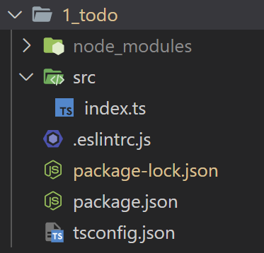

# 04. 할 일 관리 앱 (1)

## 4.1. 프로젝트 내려받기 및 라이브러리 설치

- 아래 GitHub repository를 fork 뜬 후, 클론
  - [예제코드_GitHub_링크](https://github.com/joshua1988/learn-typescript)
- `1_todo` 폴더를 vs code로 열고, terminal에서 `npm i`를 입력해서 라이브러리를 설치했음

<br>

## 4.2. 프로젝트 폴더 구조



### 4.2.1. node_modules 폴더

- 실습에 필요한 라이브러리 설치되어 있음
- NPM 기반의 웹 어플리케이션을 실행하는 데 꼭 필요한 폴더

### 4.2.2. src 폴더

- 실습 코드인 index.ts 파일 있음

### 4.2.3. .eslintrc.js 파일

- **ESLint** 설정 파일
- ESLint
  - 자바스크립트의 문법 검사 도구
  - 자바스크립트 코드를 일관된 형식으로 작성할 수 있게 도와주고 잠재적인 에러가 발생할 수 있는 코드를 경고함
  - 추가적인 구성으로 타입스크립트 코드까지 검사 가능

### 4.2.4. package.json 파일

- NPM 설정 파일
- 프로젝트 이름, 버전, 라이선스 등 프로젝트와 관련된 기본 정보 들어감
- 프로젝트를 실행하거나 로컬에서 개발할 때 필요한 라이브러리 목록 저장 가능

### 4.2.5. package-lock.json 파일

- `dependencies`나 `devDependencies`에 명시된 라이브러리를 설치할 때 필요한 부수 라이브러리의 버전 관리
- 개발자가 직접 파일의 내용을 수정하지 X

### 4.2.6. tsconfig.json 파일

- 타입스크립트 설정 파일
- 타입스크립트 컴파일을 돌릴 파일 목록과 배제할 목록, 그리고 컴파일을 구체적으로 어떻게 동작시킬지 등 다양한 옵션 지정 가능

<br>

## 4.3. 프로젝트 로직

```typescript
let todoItems;

// api
function fetchTodoItems() {
  const todos = [
    { id: 1, title: '안녕', done: false },
    { id: 2, title: '타입', done: false },
    { id: 3, title: '스크립트', done: false },
  ];
  return todos;
}

// crud methods
function fetchTodos() {
  const todos = fetchTodoItems();
  return todos;
}

function addTodo(todo) {
  todoItems.push(todo);
}

function deleteTodo(index) {
  todoItems.splice(index, 1);
}

function completeTodo(index, todo) {
  todo.done = true;
  todoItems.splice(index, 1, todo);
}

// business logic
function logFirstTodo() {
  return todoItems[0];
}

function showCompleted() {
  return todoItems.filter(item => item.done);
}

// TODO: 아래 함수의 내용을 채워보세요. 아래 함수는 `addTodo()` 함수를 이용하여 2개의 새 할 일을 추가하는 함수입니다.
function addTwoTodoItems() {
  // addTodo() 함수를 두 번 호출하여 todoItems에 새 할 일이 2개 추가되어야 합니다.
}

// NOTE: 유틸 함수
function log() {
  console.log(todoItems);
}

todoItems = fetchTodoItems();
addTwoTodoItems();
log();

```

- index.ts 파일의 코드는 할 일 관리 앱을 가정하여 제작됨
- 사용자 입력을 받아 화면을 제어하는 부분을 제외하고 할 일 목록이라는 데이터 관점에서 조작하는 부분만 간단하게 작성됨

<br>

- `fetchTodoItems()` : 할 일 목록 데이터를 반환
- `fetchTodos()` : `fetchTodoItems()` 함수의 호출 결과를 `todoItems` 변수에 담음
`todoItems` :  할 일 목록의 데이터가 담긴 변수
- `addTodo()` : 배열로 정의된 할 일 목록에 하나의 할 일 추가 (`push` 이용)
- `deleteTodo()` : 배열의 특정 인덱스에 있는 할 일 데이터를 삭제 (`splice` 이용)

<br>

- `completeTodo()` : 특정 인덱스에 있는 할 일의 완료 처리 여부를 완료로 표시한 후 데이터를 갱신 (`splice` 이용)
- `logFirstTodo()` : 첫 번째 할 일 출력
- `showComplete()` : 완료된 할 일의 목록 표시

<br>

## 4.4. 프로젝트 실습

- 목표 : 타입스크립트의 역할과 기본 타입, 변수, 함수의 타입 정의 방식을 떠올리며 타입을 정의할 수 있는 데까지 **스스로** 정의하는 것

<br>

- 알아야 할 개념

  - 타입 표기: 방식을 이용한 타입 정의 방법
  - 변수의 타입 정의 방법
  - 함수의 파라미터 타입과 반환값 타입 정의 방법

<br>

- 실습 순서

  1. ESLint의 에러(노란색 줄)가 표시되는 부분의 타입 정의 ex) 함수 반환ㄱ밧 타입
  2. `todoItems` 변수의 타입 선언
  3. `todoItems` 변수의 타입 선언에 따라 발생하는 에러 코드 정리 및 타입 정의
  4. 함수 파라미터나 내부 로직의 타입 정의
  5. `addTwoTodoItems()` 함수 구현
  6. 정의한 타입 중에서 좀 더 적절한 타입을 정의할 수 있는지 확인 및 정의
