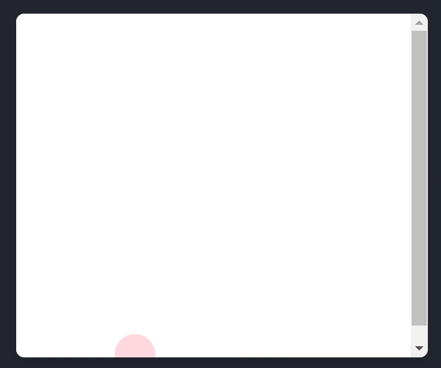
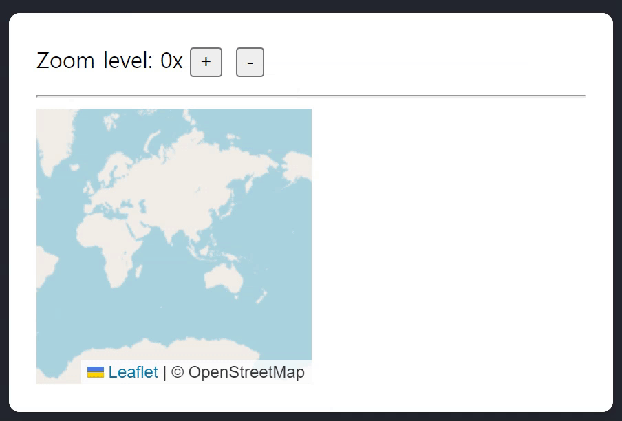

# useEffect 사용법 (2)

## 3. Usage

### 3.2. 커스텀 훅으로 Effect 감싸기

Effect는 [**탈출구**](https://react-ko.dev/reference/react/useEffect#wrapping-effects-in-custom-hooks)다. "React를 벗어나야 할 때", 또는 더 나은 빌트인 솔루션이 없을 때 사용한다. Effect를 수동으로 작성해야 하는 경우가 자주 발생한다면 이는 컴포넌트가 의존하는 일반적인 동작에 대한 [**커스텀 훅**](https://react-ko.dev/learn/reusing-logic-with-custom-hooks)을 추출해야 한다는 신호일 수 있다.

예를 들어, 이 `useChatRoom` 커스텀 훅은 Effect의 로직을 보다 선언적인 API 뒤에 "숨긴다".

<br>

```javascript
function useChatRoom({ serverUrl, roomId }) {
  useEffect(() => {
    const options = {
      serverUrl: serverUrl,
      roomId: roomId,
    };
    const connection = createConnection(options);
    connection.connect();
    return () => connection.disconnect();
  }, [roomId, serverUrl]);
}
```

<br>

그러면 모든 컴포넌트에서 이와 같이 사용할 수 있다.

```javascript
function ChatRoom({ roomId }) {
  const [serverUrl, setServerUrl] = useState("https://localhost:1234");

  useChatRoom({
    roomId: roomId,
    serverUrl: serverUrl,
  });
  // ...
}
```

<br>

이밖에도 React 생태계에는 다양한 목적에 맞는 훌륭한 커스텀 훅이 많이 있다.

<br><br>

#### 3.2.1. Effect를 커스텀 훅으로 감싸는 예시

#### Example. Custom `useWindowListener` Hook

```javascript
// App.js

import { useState } from "react";
import { useWindowListener } from "./useWindowListener.js";

export default function App() {
  const [position, setPosition] = useState({ x: 0, y: 0 });

  useWindowListener("pointermove", (e) => {
    setPosition({ x: e.clientX, y: e.clientY });
  });

  return (
    <div
      style={{
        position: "absolute",
        backgroundColor: "pink",
        borderRadius: "50%",
        opacity: 0.6,
        transform: `translate(${position.x}px, ${position.y}px)`,
        pointerEvents: "none",
        left: -20,
        top: -20,
        width: 40,
        height: 40,
      }}
    />
  );
}
```

```javascript
// useWindowListener.js

import { useState, useEffect } from "react";

export function useWindowListener(eventType, listener) {
  useEffect(() => {
    window.addEventListener(eventType, listener);
    return () => {
      window.removeEventListener(eventType, listener);
    };
  }, [eventType, listener]);
}
```



<br>

---

<br>

### 3.3. React가 아닌 위젯 제어하기

외부 시스템을 컴포넌트의 특정 prop이나 state와 동기화하고 싶을 때가 있다.

예를 들어, React 없이 작성된 타사 맵 위젯이나 비디오 플레이어 컴포넌트가 있는 경우, Effect를 사용하여 해당 state를 React 컴포넌트의 현재 state와 일치시키는 메서드를 호출할 수 있다. 이 Effect는 `map-widget.js`에 정의된 `MapWidget` 클래스의 인스턴스를 생성한다. `Map` 컴포넌트의 `zoomLevel` prop을 변경하면 Effect는 클래스 인스턴스에서 `setZoom()`을 호출하여 동기화 상태를 유지한다.

<br>

```javascript
// App.js

import { useState } from "react";
import Map from "./Map.js";

export default function App() {
  const [zoomLevel, setZoomLevel] = useState(0);
  return (
    <>
      Zoom level: {zoomLevel}x
      <button onClick={() => setZoomLevel(zoomLevel + 1)}>+</button>
      <button onClick={() => setZoomLevel(zoomLevel - 1)}>-</button>
      <hr />
      <Map zoomLevel={zoomLevel} />
    </>
  );
}
```

```javascript
// Map.js

import { useRef, useEffect } from "react";
import { MapWidget } from "./map-widget.js";

export default function Map({ zoomLevel }) {
  const containerRef = useRef(null);
  const mapRef = useRef(null);

  useEffect(() => {
    if (mapRef.current === null) {
      mapRef.current = new MapWidget(containerRef.current);
    }

    const map = mapRef.current;
    map.setZoom(zoomLevel);
  }, [zoomLevel]);

  return <div style={{ width: 200, height: 200 }} ref={containerRef} />;
}
```

```javascript
// map-widget.js

import "leaflet/dist/leaflet.css";
import * as L from "leaflet";

export class MapWidget {
  constructor(domNode) {
    this.map = L.map(domNode, {
      zoomControl: false,
      doubleClickZoom: false,
      boxZoom: false,
      keyboard: false,
      scrollWheelZoom: false,
      zoomAnimation: false,
      touchZoom: false,
      zoomSnap: 0.1,
    });
    L.tileLayer("https://tile.openstreetmap.org/{z}/{x}/{y}.png", {
      maxZoom: 19,
      attribution: "© OpenStreetMap",
    }).addTo(this.map);
    this.map.setView([0, 0], 0);
  }
  setZoom(level) {
    this.map.setZoom(level);
  }
}
```


<br>

이 예제에서는 `MapWidget` 클래스가 자신에게 전달된 DOM 노드만 관리하기 때문에 클린업 함수가 필요하지 않다. `Map` React 컴포넌트가 트리에서 제거된 후, DOM 노드와 `MapWidget`클래스 인스턴스는 브라우저 JavaScript 엔진에 의해 자동으로 가비지컬렉팅 된다.